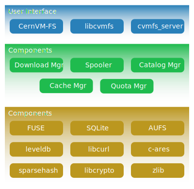
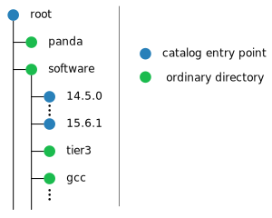
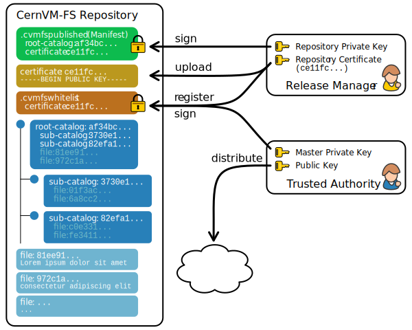
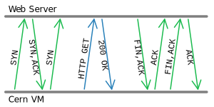
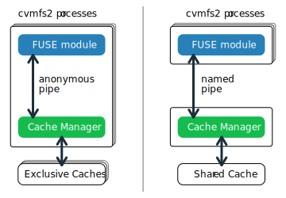

Implementation Notes
====================

CernVM-FS has a modular structure and relies on several open source libraries.
Figure :ref:`below <fig_cvmfsblocks>` shows the internal building blocks of
CernVM-FS. Most of these libraries are shipped with the CernVM-FS sources and
are linked statically in order to facilitate debugging and to keep the system
dependencies minimal.

.. _fig_cvmfsblocks:

.. _sct_filecatalog:

File Catalog
------------

A CernVM-FS repository is defined by its *file catalog*. The file
catalog is an `SQLite database <https://www.sqlite.org>`_ [Allen10]_
having a single table that lists files and directories together with
its metadata. The table layout is shown in the table below:

.. _tab_catalog:

====================== ================
**Field**               **Type**
====================== ================
Path MD5                128Bit Integer
Parent Path MD5         128Bit Integer
Hardlinks               Integer
Content Hash            BLOB
Size                    Integer
Mode                    Integer
Last Modified           Timestamp
Flags                   Integer
Name                    String
Symlink                 String
uid                     Integer
gid                     Integer
xattr                   BLOB
====================== ================

In order to save space we do not store absolute paths. Instead we
store MD5 [Rivest92]_, [Turner11]_ hash values of the absolute path
names. Symbolic links are kept in the catalog. Symbolic links may
contain environment variables in the form ``$(VAR_NAME)`` or
``$(VAR_NAME:-/default/path)`` that will be dynamically resolved by
CernVM-FS on access. Hardlinks are emulated by CernVM-FS. The hardlink
count is stored in the lower 32 bits of the hardlinks field, and a *hardlink
group* is stored in the higher 32 bits. If the hardlink group is
greater than zero, all files with the same hardlink group will get the
same inode issued by the CernVM-FS Fuse client. The emulated hardlinks
work within the same directory, only. The cryptographic content hash
refers to the zlib-compressed [Deutsch96]_ version of the file. Flags
indicate the type of an directory entry (see table :ref:`below
<tab_dirent_flags>`).

Extended attributes are either NULL or stored as a BLOB of key-value pairs.  It
starts with 8 bytes for the data structure's version (currently 1) followed by
8 bytes for the number of extended attributes.  This is followed by the list of
pairs, which start with two 8 byte values for the length of the key/value
followed by the concatenated strings of the key and the value.

.. _tab_dirent_flags:

============ ====================================
**Flags**    **Meaning**
1            Directory
2            Transition point to a nested catalog
33           Root directory of a nested catalog
4            Regular file
8            Symbolic link
68           Chunked file
132          External file (stored under path name)
============ ====================================

As of bit 8, the flags store the cryptographic content hash
algorithm used to process the given file.  Bit 11 is 1 if the file is
stored uncompressed.

A file catalog contains a *time to live* (TTL), stored in seconds. The
catalog TTL advises clients to check for a new version of the catalog,
when expired. Checking for a new catalog version takes place with the
first file system operation on a CernVM-FS volume after the TTL has
expired. The default TTL is 4 minutes. If a new catalog is available,
CernVM-FS delays the loading for the period of the CernVM-FS kernel
cache life time (default: 1 minute). During this drain-out period, the
kernel caching is turned off. The first file system operation on a
CernVM-FS volume after that additional delay will apply a new file
catalog and kernel caching is turned back on.

Content Hashes
~~~~~~~~~~~~~~

CernVM-FS can use SHA-1 [Jones01]_, RIPEMD-160 [Dobbertin96]_ and
SHAKE-128 [Bertoni09]_ as cryptographic hash function. The hash function
can be changed on the Stratum 0 during the lifetime of repositories.
On a change, new and updated files will use the new cryptographic hash
while existing files remain unchanged. This is transparent to the clients
since the hash function is stored in the flags field of file catalogs for
each and every file. The default hash function is SHA-1.
New software versions might introduce support for further cryptographic
hash functions.

Nested Catalogs
~~~~~~~~~~~~~~~

In order to keep catalog sizes reasonable [#]_, repository subtrees may be cut
and stored as separate *nested catalogs*. There is no limit on the level of
nesting. A reasonable approach is to store separate software versions as
separate nested catalogs. The figure :ref:`below <fig_nested>` shows the
simplified directory structure which we use for the ATLAS repository.

.. _fig_nested:

   Directory structure used for the ATLAS repository (simplified).

When a subtree is moved into a nested catalog, its entry directory
serves as *transition point* for nested catalogs. This directory appears
as empty directory in the parent catalog with flags set to 2. The same
path appears as root-directory in the nested catalog with flags set to
33. Because the MD5 hash values refer to full absolute paths, nested
catalogs store the root path prefix. This prefix is prepended
transparently by CernVM-FS. The cryptographic hash of nested catalogs is
stored in the parent catalog. Therefore, the root catalog fully defines
an entire repository.

Loading of nested catalogs happens on demand by CernVM-FS on the first
attempt to access of anything inside, a user won't see the difference
between a single large catalog and several nested catalogs. While this
usually avoids unnecessary catalogs to be loaded, recursive operations
like ``find`` can easily bypass this optimization.

Catalog Statistics
~~~~~~~~~~~~~~~~~~

A CernVM-FS file catalog maintains several counters about its contents
and the contents of all of its nested catalogs. The idea is that the
catalogs know how many entries there are in their sub catalogs even
without opening them. This way, one can immediately tell how many
entries, for instance, the entire ATLAS repository has. Some of the
numbers are shown using the number of inodes in ``statvfs``. So
``df -i`` shows the overall number of entries in the repository and (as
number of used inodes) the number of entries of currently loaded
catalogs. Nested catalogs create an additional entry (the transition
directory is stored in both the parent and the child catalog). File
hardlinks are still individual entries (inodes) in the cvmfs catalogs.
The following counters are maintained for both a catalog itself and for
the subtree this catalog is root of:

-  Number of regular files

-  Number of symbolic links

-  Number of directories

-  Number of nested catalogs

-  Number of external files

-  Number of chunked files

-  Number of individual file chunks

-  Overall file content size

-  File content size stored in chunked files

Repository Manifest (.cvmfspublished)
-------------------------------------

Every CernVM-FS repository contains a repository manifest file that
serves as entry point into the repository's catalog structure. The
repository manifest is the first file accessed by the CernVM-FS client
at mount time and therefore must be accessible via HTTP on the
repository root URL. It is always called **.cvmfspublished** and
contains fundamental repository meta data like the root catalog's
cryptographic hash and the repository revision number as a key-value
list.

.. _sct_manifeststructure:

Internal Manifest Structure
~~~~~~~~~~~~~~~~~~~~~~~~~~~

Below is an example of a typical manifest file. Each line starts with a
capital letter specifying the meta data field, followed by the actual data
string. The list of meta information is ended by a separator line (``--``)
followed by signature information further described :ref:`here
<sct_cvmfspublished_signature>`.

::

        C64551dccfbe0a48de7618dd7deb290200b474759
        B1442336
        Rd41d8cd98f00b204e9800998ecf8427e
        D900
        S42
        Nexample.cern.ch
        X731cca9476eb882f5a3f24aaa38001105a0e35eb
        T1390301299
        --
        edde5308e502dd5e8fe405c56f5700f7477dc319
        [...]

Please refer to
table below for detailed information about each of the
meta data fields.

.. |br| raw:: html

    

+-----------+-------------------------------------------------------------+
| **Field** | **Meta Data Description**                                   |
+-----------+-------------------------------------------------------------+
| ``C``     | Cryptographic hash of the repository's current root catalog |
+-----------+-------------------------------------------------------------+
| ``B``     | Size of the root file catalog in bytes                      |
+-----------+-------------------------------------------------------------+
| ``A``     | "yes" if the catalog should be fetched under its    |br|    |
|           | alternative name (outside servers /data directory)          |
+-----------+-------------------------------------------------------------+
| ``R``     | MD5 hash of the repository's root path         |br|         |
|           | (usually always ``d41d8cd98f00b204e9800998ecf8427e``)       |
+-----------+-------------------------------------------------------------+
| ``X``     | Cryptographic hash of the signing certificate               |
+-----------+-------------------------------------------------------------+
| ``G``     | "yes" if the repository is garbage-collectable              |
+-----------+-------------------------------------------------------------+
| ``H``     | Cryptographic hash of the repository's named tag history    |
|           | database                                                    |
+-----------+-------------------------------------------------------------+
| ``T``     | Unix timestamp of this particular revision                  |
+-----------+-------------------------------------------------------------+
| ``D``     | Time To Live (TTL) of the root catalog                      |
+-----------+-------------------------------------------------------------+
| ``S``     | Revision number of this published revision                  |
+-----------+-------------------------------------------------------------+
| ``N``     | The full name of the manifested repository                  |
+-----------+-------------------------------------------------------------+
| ``M``     | Cryptographic hash of the repository JSON metadata          |
+-----------+-------------------------------------------------------------+
| ``Y``     | Cryptographic hash of the reflog checksum                   |
+-----------+-------------------------------------------------------------+
| ``L``     | currently unused (reserved for micro catalogs)              |
+-----------+-------------------------------------------------------------+

.. _sct_cvmfspublished_signature:

Repository Signature
~~~~~~~~~~~~~~~~~~~~

In order to provide authoritative information about a repository
publisher, the repository manifest is signed by an X.509 certificate
together with its private key.

Signing a Repository
^^^^^^^^^^^^^^^^^^^^

It is important to note that it is sufficient to sign just the manifest
file itself to gain a secure chain of the whole repository. The manifest
refers to the cryptographic content hash of the root catalog which in
turn recursively references all sub-catalogs with their cryptographic
content hashes. Each catalog lists its files along with their
cryptographic content hashes. This concept is called a merkle tree and
eventually provides a single hash that depends on the *complete* content
of the repository.

The top level hash used for the repository signature can be found in the
repository manifest right below the separator line (``--`` /
:ref:`see above <sct_manifeststructure>`).
It is the cryptographic hash of the manifest's meta data lines excluding
the separator line. Following the top level hash is the actual signature
produced by the X.509 certificate signing procedure in binary form.

Signature Validation
^^^^^^^^^^^^^^^^^^^^

In order to validate repository manifest signatures, CernVM-FS uses a
white-list of valid publisher certificates. The white-list contains the
cryptographic fingerprints of known publisher certificates and a
timestamp. A white-list is valid for 30 days. It is signed by a private
RSA key, which we refer to as *master key*. The public RSA key that
corresponds to the master key is distributed with the
``cvmfs-config-...`` RPMs as well as with every instance of CernVM.

As crypto engine, CernVM-FS uses libcrypto from the `OpenSSL project
<https://www.openssl.org/docs/manmaster/man3/>`_.

.. _sct_blacklisting:

Blacklisting
^^^^^^^^^^^^

In addition to validating the white-list, CernVM-FS checks certificate
fingerprints against the local black-list /etc/cvmfs/blacklist and the
blacklist in an optional :ref:`"Config Repository" <sct_config_repository>`.
The blacklisted fingerprints have to be in the same format as the
fingerprints on the white-list. The black-list has precedence over the
white-list.

Blacklisted fingerprints prevent clients from loading future
repository publications by a corresponding compromised repository key,
but they do not prevent mounting a repository revision that had
previously been mounted on a client, because the catalog for that
revision is already in the cache.  However, the same blacklist files
also support another format that actively blocks revisions associated
with a compromised repository key from being mounted and even forces
them to be unmounted if they are mounted.  The format for that is a
less-than sign followed by the repository name followed by a blank and
a repository revision number:

::

        <repository.name NNN

This will prevent all revisions of a repository called repository.name
less than the number NNN from being mounted or staying mounted.  An
effective protection against a compromised repository key will use
both this format to prevent mounts and the fingerprint format to
prevent accepting future untrustworthy publications signed by the
compromised key.

Use of HTTP
-----------

The particular way of using the HTTP protocol has significant impact on
the performance and usability of CernVM-FS. If possible, CernVM-FS tries
to benefit from the HTTP/1.1 features keep-alive and cache-control.
Internally, CernVM-FS uses the `libcurl library <http://curl.haxx.se/libcurl>`_.

The HTTP behaviour affects a system with cold caches only. As soon as
all necessary files are cached, there is only network traffic when a
catalog TTL expires. The CernVM-FS download manager runs as a separate
thread that handles download requests asynchronously in parallel.
Concurrent download requests for the same URL are collapsed into a
single request.

DoS Protection
~~~~~~~~~~~~~~

A subtle denial of service attack (DoS) can occur when CernVM-FS is
successfully able to download a file but fails to store it in the local
cache. This situation escalates into a DoS when the application using
CernVM-FS remains in an endless loop and tries to open a file over and
over again. Such a situation is prevented by CernVM-FS by re-trying with
an exponential backoff. The backoff is triggered by consecutive failures
to cache a downloaded file within 10 seconds.

Keep-Alive
~~~~~~~~~~

Although the HTTP protocol overhead is small in terms of data volume, in
high latency networks we suffer from the bare number of requests: Each
request-response cycle has a penalty of at least the network round trip
time. Using plain HTTP/1.0, this results in at least
:math:`3\cdot\text{round trip time}` additional running time per file
download for TCP handshake, HTTP GET, and TCP connection finalisation.
By including the ``Connection: Keep-Alive`` header into HTTP requests,
we advise the HTTP server end to keep the underlying TCP connection
opened. This way, overhead ideally drops to just round trip time for a
single HTTP GET. The impact of the keep-alive feature is shown in
here.

This feature, of course, somewhat sabotages a server-side
load-balancing. However, exploiting the HTTP keep-alive feature does not
affect scalability per se. The servers and proxies may safely close idle
connections anytime, in particular if they run out of resources.

Cache Control
~~~~~~~~~~~~~

In a limited way, CernVM-FS advises intermediate web caches how to
handle its requests. Therefore it uses the ``Pragma: no-cache`` and the
``Cache-Control: no-cache`` headers in certain cases. These cache
control headers apply to both, forward proxies as well as reverse
proxies. This is not a guarantee that intermediate proxies fetch a fresh
original copy (though they should).

By including these headers, CernVM-FS tries to not fetch outdated cache
copies. Only in case CernVM-FS downloads a corrupted file from a proxy
server, it retries having the HTTP ``no-cache`` header set. This way,
the corrupted file gets replaced in the proxy server by a fresh copy
from the backend.

Identification Header
~~~~~~~~~~~~~~~~~~~~~

CernVM-FS sends the ``User-Agent`` header set to either of ``libcvmfs`` or
``Fuse`` depending on how it was compiled, plus the current ``VERSION`` value.
If the ``CERNVM_UUID`` environment variable is set, that's also included in the
``User-Agent`` field.

Redirects
~~~~~~~~~

Normally, the Stratum-1 servers directly respond to HTTP requests so
CernVM-FS has no need to support HTTP redirect response codes. However,
there are some high-bandwidth applications where HTTP redirects are used
to transfer requests to multiple data servers. To enable support for
redirects in the CernVM-FS client, set ``CVMFS_FOLLOW_REDIRECTS=yes``.

Name Resolving
--------------

Round-robin DNS entries for proxy servers are treated specially by
CernVM-FS. Multiple IP addresses for the same proxy name are
automatically transformed into multiple proxy servers within the same
load-balance group. So the usual rules for load-balancing and fail-over
apply to the different servers in a round-robin entry.
CernVM-FS resolves all the proxy servers at once (and in parallel) at
mount time. From that point on, proxy server names are resolved on
demand, when a download takes place and the TTL of the active proxy
expired. CernVM-FS resolves using /etc/host (resp. the file referenced
in the ``HOST_ALIASES`` environment variable) or, if a host name is not
resolvable locally, it uses the c-ares resolver. Proxy servers given in
IP notation remain unchanged.

CernVM-FS uses the TTLs that come from DNS servers. However, there is a
cutoff at 1 minute minimum TTL and 1 day maximum TTL. Locally resolved
host names get a TTL of 1 minute. The host alias file is re-read with
every attempt to resolve a name. Failed attempts to resolve a name
remain cached for 1 minute, too. If a name has been successfully
resolved previously, this result stays active until another successful
attempt is done. If the DNS entries change for a host name,
CernVM-FS adjust the corresponding load-balance group and picks a new
server from the group at random.

The name resolving silently ignores errors in individual records. Only
if no valid IP address is returned at all it counts as an error. IPv4
addresses have precedence if available. If the ``CVMFS_IPV4_ONLY``
environment variable is set, CernVM-FS does not try to resolve IPv6
records.

The timeout for name resolving is hard-coded to 2 attempts with a
timeout of 3 seconds each. This is independent from the
``CVMFS_TIMEOUT`` and ``CVMFS_TIMEOUT_DIRECT`` settings. The effective
timeout can be a bit longer than 6 seconds because of a backoff.

The name server used by CernVM-FS is looked up only once on start. If
the name server changes during the life time of a CernVM-FS mount point,
this change needs to be manually advertised to CernVM-FS using
``cvmfs_talk nameserver set``.

Disk Cache
----------

Each running CernVM-FS instance requires a local cache directory. Data
are downloaded into a temporary files. Only at the very latest point
they are renamed into their content-addressable names atomically by
``rename()``.

The hard disk cache is managed, CernVM-FS maintains cache size
restrictions and replaces files according to the least recently used
(LRU) strategy [Panagiotou06]_. In order to keep track of files sizes
and relative file access times, CernVM-FS sets up another SQLite
database in the cache directory, the *cache catalog*. The cache
catalog contains a single table; its structure is shown here:

================================= =========================
**Field**                         **Type**
Hash                              String (hex notation)
Size                              Integer
Access Sequence                   Integer
Pinned                            Integer
File type (chunk or file catalog) Integer
================================= =========================

CernVM-FS does not strictly enforce the cache limit. Instead
CernVM-FS works with two customizable soft limits, the *cache quota* and
the *cache threshold*. When exceeding the cache quota, files are deleted
until the overall cache size is less than or equal to the cache
threshold. The cache threshold is currently hard-wired to half of the
cache quota. The cache quota is for data files as well as file catalogs.
Currently loaded catalogs are pinned in the cache, they will not be
deleted until unmount or until a new repository revision is applied. On
unmount, pinned file catalogs are updated with the highest sequence
number. As a pre-caution against a cache that is blocked by pinned
catalogs, all catalogs except the root catalog are unpinned when the
volume of pinned catalogs exceeds the overall cache volume.

The cache catalog can be re-constructed from scratch on mount.
Re-constructing the cache catalog is necessary when the managed cache is
used for the first time and every time when "unmanaged" changes occurred
to the cache directory, when CernVM-FS was terminated unexpectedly.

In case of an exclusive cache, the cache manager runs as a separate thread of
the ``cvmfs2`` process. This thread gets notified by the Fuse module whenever
a file is opened or inserted. Notification is done through a pipe. The shared
cache uses the very same code, except that the thread becomes a separate
process (see Figure :ref:`below <fig_sharedcache>`). This cache manager
process is not another binary but ``cvmfs2`` forks to itself with special
arguments, indicating that it is supposed to run as a cache manager. The cache
manager does not need to be started as a service. The first CernVM-FS instance
that uses a shared cache will automatically spawn the cache manager process.
Subsequent CernVM-FS instances will connect to the pipe of this cache manager.
Once the last CernVM-FS instance that uses the shared cache is unmounted, the
communication pipe is left without any writers and the cache manager
automatically quits.

.. _fig_sharedcache:

The CernVM-FS cache supports two classes of files with respect to the
cache replacement strategy: *normal* files and *volatile* files. The
sequence numbers of volatile files have bit 63 set. Hence they are
interpreted as negative numbers and have precedence over normal files
when it comes to cache cleanup. On automatic rebuild the volatile
property of entries in the cache database is lost.

NFS Maps
--------

In normal mode, CernVM-FS issues inodes based on the row number of an
entry in the file catalog. When exported via NFS, this scheme can
result in inconsistencies because CernVM-FS does not control the cache
lifetime of NFS clients. A once issued inode can be asked for anytime
later by a client. To be able to reply to such client queries even
after reloading catalogs or remounts of CernVM-FS, the CernVM-FS *NFS
maps* implement a persistent store of the path names :math:`\mapsto`
inode mappings. Storing them on hard disk allows for control of the
CernVM-FS memory consumption (currently :math:`\approx` 45 MB extra)
and ensures consistency between remounts of CernVM-FS. The performance
penalty for doing so is small. CernVM-FS uses `Google's leveldb
<https://github.com/google/leveldb>`_, a fast, local key value store.
Reads and writes are only performed when meta-data are looked up in
SQLite, in which case the SQLite query supposedly dominates the
running time.

A drawback of the NFS maps is that there is no easy way to account for
them by the cache quota. They sum up to some 150-200 Bytes per path name
that has been accessed. A recursive ``find`` on /cvmfs/atlas.cern.ch
with 50 million entries, for instance, would add up 8GB in the cache
directory. This is mitigated by the fact that the NFS mode will be only
used on few servers that can be given large enough spare space on hard
disk.

Loader
------

The CernVM-FS Fuse module comprises a minimal *loader* loader process
(the ``cvmfs2`` binary) and a shared library containing the actual
Fuse module (``libcvmfs_fuse.so``, ``libcvmfs_fuse3.so``). This structure makes
it possible to reload CernVM-FS code and parameters without unmounting the file
system. Loader and library don't share any symbols except for two global structs
``cvmfs_exports`` and ``loader_exports`` used to call each others
functions. The loader process opens the Fuse channel and implements stub
Fuse callbacks that redirect all calls to the CernVM-FS shared library.
Hotpatch is implemented as unloading and reloading of the shared
library, while the loader temporarily queues all file system calls
in-between. Among file system calls, the Fuse module has to keep very
little state. The kernel caches are drained out before reloading. Open
file handles are just file descriptors that are held open by the
process. Open directory listings are stored in a Google dense\_hash that
is saved and restored.

File System Interface
---------------------

CernVM-FS implements the following read-only file system call-backs.

mount
~~~~~

On mount, the file catalog has to be loaded. First, the file catalog
*manifest* ``.cvmfspublished`` is loaded. The manifest is only accepted
on successful validation of the signature. In order to validate the
signature, the certificate and the white-list are downloaded in addition
if not found in cache. If the download fails for whatever reason,
CernVM-FS tries to load a local file catalog copy. As long as all
requested files are in the disk cache as well, CernVM-FS continues to
operate even without network access (*offline mode*). If there is no
local copy of the manifest or the downloaded manifest and the cache copy
differ, CernVM-FS downloads a fresh copy of the file catalog.

getattr and lookup
~~~~~~~~~~~~~~~~~~

Requests for file attributes are entirely served from the mounted
catalogs, there is no network traffic involved. This function is called
as pre-requisite to other file system operations and therefore the most
frequently called Fuse callback. In order to minimize relatively
expensive SQLite queries, CernVM-FS uses a hash table to store negative
and positive query results. The default size for this memory cache is
determined according to benchmarks with LHC experiment software.

Additionally, the callback takes care of the catalog TTL. If the TTL is
expired, the catalog is re-mounted on the fly. Note that a re-mount
might possibly break running programs. We rely on careful repository
publishers that produce more or less immutable directory trees, new
repository versions just add files.

If a directory with a nested catalog is accessed for the first time, the
respective catalog is mounted in addition to the already mounted
catalogs. Loading nested catalogs is transparent to the user.

readlink
~~~~~~~~

A symbolic link is served from the file catalog. As a special extension,
CernVM-FS detects environment variables in symlink strings written as
``$(VARIABLE)`` or ``$(VARIABLE:-/default/path)``. These variables are
expanded by CernVM-FS dynamically on access (in the context of the
``cvmfs2`` process). This way, a single symlink can point to different
locations depending on the environment. This is helpful, for instance,
to dynamically select software package versions residing in different
directories.

readdir
~~~~~~~

A directory listing is served by a query on the file catalog. Although the
"parent"-column is indexed (see :ref:`Catalog table schema <tab_catalog>`),
this is a relatively slow function. We expect directory listing to happen
rather seldom.

open / read
~~~~~~~~~~~

The ``open()`` call has to provide a file descriptor for a given path
name. In CernVM-FS file requests are always served from the disk cache.
The Fuse file handle is a file descriptor valid in the context of the
CernVM-FS process. It points into the disk cache directory. Read
requests are translated into the ``pread()`` system call.

getxattr
~~~~~~~~

CernVM-FS uses synthetic extended attributes to display additional repository
information. There are the following supported magic attributes:

**catalog\_counters**
    Like ``repo_counters`` but only for the nested catalog that hosts the given path.

**chunks**
    Number of chunks of a regular file.

**chunk\_list**
    Hashes and sizes of the chunks of a regular (large) file.

**compression**
    Compression algorithm, for regular files only.  Either "zlib" or "none".

**expires**
    Shows the remaining life time of the mounted root file catalog in
    minutes.

**external\_file**
    Indicates if a regular file is an external file or not.  Either 0 or 1.

**external\_host**
    Like ``host`` but for the host settings to fetch external files.

**external\_timeout**
    Like ``timeout`` but for the host settings to fetch external files.

**fqrn**
    Shows the fully qualified repository name of the mounted repository.

**hash**
    Shows the cryptographic hash of a regular file as listed in the file
    catalog.

**host**
    Shows the currently active HTTP server.

**host\_list**
    Shows the ordered list of HTTP servers.

**inode\_max**
    Shows the highest possible inode with the current set of loaded
    catalogs.

**lhash**
    Shows the cryptographic hash of a regular file as stored in the
    local cache, if available.

**maxfd**
    Shows the maximum number of file descriptors available to file
    system clients.

**ncleanup24**
    Shows the number of cache cleanups in the last 24 hours.

**nclg**
    Shows the number of currently loaded nested catalogs.

**ndiropen**
    Shows the overall number of opened directories.

**ndownload**
    Shows the overall number of downloaded files since mounting.

**nioerr**
    Shows the total number of I/O errors encoutered since mounting.

**nopen**
    Shows the overall number of ``open()`` calls since mounting.

**pid**
    Shows the process id of the CernVM-FS Fuse process.

**proxy**
    Shows the currently active HTTP proxy.

**pubkeys**
    The loaded public RSA keys used for repository whitelist verification.

**rawlink**
    Shows unresolved variant symbolic links; only accessible from the
    root attribute namespace (use `attr -Rg rawlink`).

**repo\_counters**
    Shows the aggregate counters of the repository contents (number of files
    etc.)

**repo\_metainfo**
    Shows the :ref:`repository meta info <sct_metainfo>` file, if available

**revision**
    Shows the file catalog revision of the mounted root catalog, an
    auto-increment counter increased on every repository publish.

**root\_hash**
    Shows the cryptographic hash of the root file catalog.

**rx**
    Shows the overall amount of downloaded kilobytes.

**speed**
    Shows the average download speed.

**tag**
    The configured repository tag.

**timeout**
    Shows the timeout for proxied connections in seconds.

**timeout\_direct**
    Shows the timeout for direct connections in seconds.

**uptime**
    Shows the time passed since mounting in minutes.

**usedfd**
    Shows the number of file descriptors currently issued to file system
    clients.

**version**
    Shows the version of the loaded CernVM-FS binary.

Extended attributes can be queried using the ``attr`` command. For
instance, ``attr -g hash /cvmfs/atlas.cern.ch/ChangeLog`` returns the
cryptographic hash of the file at hand. The extended attributes are used
by the ``cvmfs_config stat`` command in order to show a current overview
of health and performance numbers.

Repository Publishing
---------------------

Repositories are not immutable, every now and then they get updated.
This might be installation of a new release or a patch for an existing
release. But, of course, each time only a small portion of the
repository is touched, say out of . In order not to re-process an entire
repository on every update, we create a read-write file system interface
to a CernVM-FS repository where all changes are written into a distinct
scratch area.

Read-write Interface using a Union File System
~~~~~~~~~~~~~~~~~~~~~~~~~~~~~~~~~~~~~~~~~~~~~~

Union file systems combine several directories into one virtual file
system that provides the view of merging these directories. These
underlying directories are often called *branches*. Branches are
ordered; in the case of operations on paths that exist in multiple
branches, the branch selection is well-defined. By stacking a read-write
branch on top of a read-only branch, union file systems can provide the
illusion of a read-write file system for a read-only file system. All
changes are in fact written to the read-write branch.

Preserving POSIX semantics in union file systems is non-trivial; the
first fully functional implementation has been presented by Wright et
al. [Wright04]_. By now, union file systems are well established for
"Live CD" builders, which use a RAM disk overlay on top of the read-only
system partition in order to provide the illusion of a fully
read-writable system. CernVM-FS supports both aufs and OverlayFS
union file systems.

Union file systems can be used to track changes on CernVM-FS repositories
(Figure :ref:`below <fig_overlay>`). In this case, the read-only file system
interface of CernVM-FS is used in conjunction with a writable scratch area for
changes.

.. _fig_overlay:

.. figure:: _static/overlay.svg
   :alt: CernVM-FS Server update workflow
   :figwidth: 450
   :align: center

   A union file system combines a CernVM-FS read-only mount point and
   a writable scratch area. It provides the illusion of a writable
   CernVM-FS mount point, tracking changes on the scratch area.

Based on the read-write interface to CernVM-FS, we create a feed-back
loop that represents the addition of new software releases to a
CernVM-FS repository. A repository in base revision :math:`r` is mounted
in read-write mode on the publisher's end. Changes are written to the
scratch area and, once published, are re-mounted as repository revision
:math:`r+1`. In this way, CernVM-FS provides snapshots. In case of
errors, one can safely resume from a previously committed revision.

.. rubric:: Footnotes

.. [#]
   As a rule of thumb, file catalogs (when compressed) are reasonably
   small.
