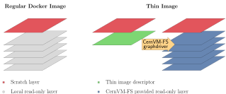

.. _cpt_graphdriver:

CernVM-FS Graph Driver Plugin for Docker
========================================

The CernVM-FS graph driver plugin for Docker provides a dockerized CernVM-FS
client that can be used by the Docker daemon to access and store container
images that reside in an extracted form on a CernVM-FS repository.
Because CernVM-FS downloads the files of a container image only when accessed
and because typically very little of a container image is accessed at runtime,
the CernVM-FS graph driver can remove the bottleneck of distributing (large)
container images to (many) nodes.

The CernVM-FS graph driver can run any normal image from a Docker registry.
Additionally, it can run so called *Thin Images*. A thin image is like a
symbolic link for container images. It is a regular, very small image in the
registry. It contains a single file, the *thin image descriptor*, that specifies
where in a CernVM-FS repository the actual image contents can be found. The
``docker2cvmfs`` utility can be used to convert a regular image to a thin image.

Requirements
------------

The graph driver plugin requires Docker version > 17 and a host kernel with
either aufs or overlay2 support, which includes RHEL >= 7.3. Please note that
on RHEL 7, Docker's data root should reside either on an ext file system or on
an xfs file system that is formatted with the ``ftype=1`` mount option.

The Docker graph driver plugin receives its CernVM-FS configuration by default
from the Docker host's /etc/cvmfs directory. The easiest way to populate
/etc/cvmfs is to install the ``cvmfs-config-default`` package (or any other
``cvmfs-config-...`` package) on the Docker host.  Alternatively, a directory
structure resembling the /etc/cvmfs hierarchy can by manually created and linked
to the graph driver plugin.

Installation
------------

The following steps install and activate the CernVM-FS graph driver plugin.

 1. Install the plugin with ``docker plugin install cvmfs/graphdriver``. The
    command ``docker plugin ls`` should now show the new plugin as being
    activated.

 2. Create or edit the file ``/etc/docker/daemon.json`` so that it contains
    the following content ::

        {
          "experimental": true,
          "storage-driver": "cvmfs/graphdriver",

          // To change the docker data root to an ext formatted location (remove this line)
          "data-root": "/path/to/ext/mountpoint",

          // Add the following storage option on RHEL 7 (remove this line)
          "storage-opts": [
            "overlay2.override_kernel_check=true"
          ]
        }

 3. Restart the Docker daemon with ``systemctl restart docker``.

 4. Test the new plugin with a normal image ::

        docker run -it --rm ubuntu /bin/bash

    and with a thin image ::

        docker run -it --rm cvmfs/thin_ubuntu /bin/bash

In order to get debugging output, add ``"debug": true`` to the
/etc/docker/daemon.json file.

Location of the Plugin Configuration
~~~~~~~~~~~~~~~~~~~~~~~~~~~~~~~~~~~~

By default, the plugin tries to bind mount the host's /etc/cvmfs directory
as a source of configuration. Other locations can be linked to the container
by running ::

     docker plugin set cvmfs/graphdriver cvmfs_ext_config="/alternative/location"
     docker plugin set cvmfs/graphdriver minio_ext_config="/alternative/location"

Installation from a Plugin Tarball
~~~~~~~~~~~~~~~~~~~~~~~~~~~~~~~~~~

Instead of installing the plugin from the Docker registry, it can be installed
directly from a tarball. To do so, `download <https://ecsft.cern.ch/dist/cvmfs/docker-graphdriver>`_
and untar a graph driver plugin tarball.  Run ::

    docker plugin create my-graphdriver cvmfs-graphdriver-plugin-$VERSION
    docker plugin enable my-graphdriver

**Note**: currently, the graph driver name (``my-graphdriver``) must not contain
a colon (``:``) nor a comma (``,``).  This issue will be fixed in a later
version.

Conversion of Images
--------------------

A simple way to ingest docker images inside a cvmfs repository is available
through a small utility ``docker2cvmfs``.

At the moment it is possible to directly download the executable:
`docker2cvmfs v0.3 <https://ecsft.cern.ch/dist/cvmfs/docker2cvmfs/0.3/docker2cvmfs>`_

``docker2cvmfs`` provides different commands to manipulate docker images but
the simplest way is to use the ``make-thin`` sub-command.

This sub-command expects to find on the host machine a recent version of
``cvmfs_server`` that supports the ``ingest`` command.

Invoking the help of the subcommand ``docker2cvmfs make-thin --help`` explains
what options are available and how to use them.

Below we provide a complete example on how to use ``docker2cvmfs`` to convert
the docker image of ``Redis`` into a thin image.

Assuming a cvmfs repository called ``example.cern.ch`` is already in place::

    ./docker2cvmfs make-thin --input-reference library/redis:4 --output-reference thin/redis:4 --repository example.cern.ch

The utility takes as input the reference (``library/redis:4``) to the
image to ingest into ``cvmfs`` along with the reference to associate to the
new thin image (``thin/redis:4``) and the repository where we want to store
the several layers (``example.cern.ch``).

The utility downloads every layer that composes the image, stores them into the
repository, creates the new thin image and imports that into docker.

By default the layers are stored into the ``layers/`` subdirectory of the
repository; this can be modified using the ``--subdirectory`` parameters.

The images are downloaded, by default, from the official docker hub registry,
this can be modified as well using the ``--registry`` parameter.

