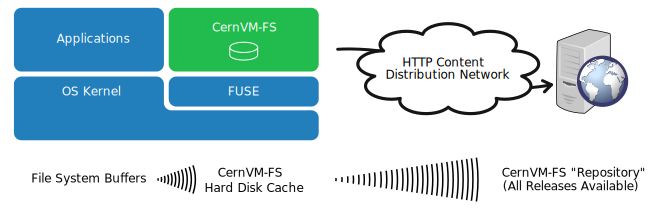
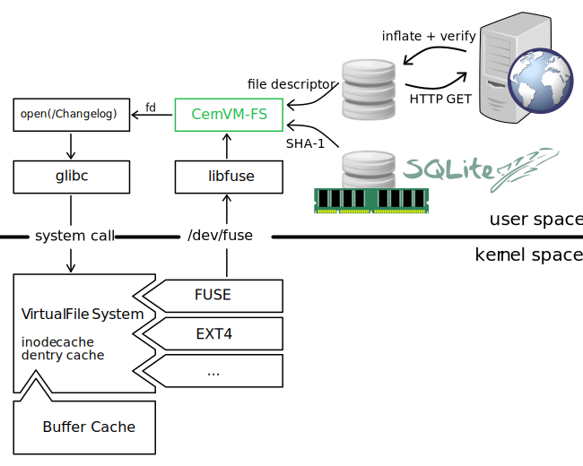

Overview
========

The CernVM File System (CernVM-FS) is a read-only file system designed
to deliver scientific software onto virtual machines and physical
worker nodes in a fast, scalable, and reliable way. Files and file
metadata are downloaded on demand and aggressively cached. For the
distribution of files, CernVM-FS uses a standard HTTP [BernersLee96]_
[Fielding99]_ transport, which allows exploitation of a variety of web
caches, including commercial content delivery networks. CernVM-FS
ensures data authenticity and integrity over these possibly untrusted
caches and connections. The CernVM-FS software comprises client-side
software to mount "CernVM-FS repositories" (similar to AFS volumes) as
well as a server-side toolkit to create such distributable CernVM-FS
repositories.

   A CernVM-FS client provides a virtual file system that loads data
   only on access. In this example, all releases of a sofware package
   (such as an HEP experiment framework) are hosted as a
   CernVM-FS repository on a web server.

The first implementation of CernVM-FS was based on grow-fs
[Compostella10]_ [Thain05]_, which was originally provided as one of
the private file system options available in Parrot. Ever since the
design evolved and diverged, taking into account the works on HTTP-
Fuse [Suzaki06]_ and content-delivery networks [Freedman03]_
[Nygren10]_ [Tolia03]_. Its current implementation provides the
following key features:

-  Use of the the `Fuse kernel module <http://fuse.sourceforge.net>`_
   that comes with in-kernel caching of file data and file attributes

-  Cache quota management

-  Use of a content addressable storage format resulting in immutable
   files and automatic file de-duplication

-  Possibility to split a directory hierarchy into sub catalogs at
   user-defined levels

-  Automatic updates of file catalogs controlled by a time to live
   stored inside file catalogs

-  Digitally signed repositories

-  Transparent file compression/decompression and transparent file
   chunking

-  Capability to work in offline mode providing that all required files
   are cached

-  File system versioning

-  File system hotpatching

-  Dynamic expansion of environment variables embedded in symbolic links

-  Automatic mirror server selection based on geographic proximity

-  Automatic load-balancing of proxy servers

-  Support for WPAD/PAC auto-configuration of proxy servers

-  Efficient replication of repositories

-  Possibility to use S3 compatible storage instead of a file system as
   repository storage

In contrast to general purpose network file systems such as nfs or afs,
CernVM-FS is particularly crafted for fast and scalable software
distribution. Running and compiling software is a use case general
purpose distributed file systems are not optimized for. In contrast to
virtual machine images or Docker images, software installed in
CernVM-FS does not need to be further packaged. Instead it is
distributed and versioned file-by-file. In order to create and update a
CernVM-FS repository, a distinguished machine, the so-called *Release
Manager Machine*, is used. On such a release manager machine, a
CernVM-FS repository is mounted in read/write mode by means of a union
file system [Wright04]_. The union file system overlays the CernVM-FS read-only
mount point by a writable scratch area. The CernVM-FS server tool kit
merges changes written to the scratch area into the
CernVM-FS repository. Merging and publishing changes can be triggered at
user-defined points in time; it is an atomic operation. As such, a
CernVM-FS repository is similar to a repository in the sense of a
versioning system.

On the client, only data and metadata of the software releases that are
actually used are downloaded and cached.

   Opening a file on CernVM-FS. CernVM-FS resolves the name by means of
   an SQLite catalog. Downloaded files are verified against the
   cryptographic hash of the corresponding catalog entry. The ``read()``
   and the ``stat()`` system call can be entirely served from the
   in-kernel file system buffers.
