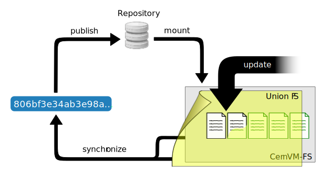

Creating a Repository (Stratum 0)
=================================

CernVM-FS is a file system with a single source of (new) data. This
single source, the repository *Stratum 0*, is maintained by a dedicated
*release manager machine* or *publisher*. A read-writable copy of
the repository is accessible on the publisher. The CernVM-FS server tool kit
is used to *publish* the current state of the repository on the
release manager machine. Publishing is an atomic operation.

All data stored in CernVM-FS have to be converted into a
CernVM-FS *repository* during the process of publishing. The
CernVM-FS repository is a form of content-addressable storage.
Conversion includes creating the file catalog(s), compressing new and
updated files and calculating content hashes. Storing the data in a
content-addressable format results in automatic file de-duplication. It
furthermore simplifies data verification and it allows for file system
snapshots.

In order to provide a writable CernVM-FS repository, CernVM-FS uses a union
file system that combines a read-only CernVM-FS mount point with a writable
scratch area. :ref:`This figure below <fig_updateprocess>` outlines
the process of publishing a repository.

CernVM-FS Server Quick-Start Guide
----------------------------------

System Requirements
~~~~~~~~~~~~~~~~~~~

-  Apache HTTP server *or* S3 compatible storage service

-  union file system in the kernel

   - AUFS

   - OverlayFS (as of kernel version 4.2.x or RHEL7.3)

-  Officially supported platforms

   -  CentOS/SL >= 7.3, provided that /var/spool/cvmfs is served by an ext4
      file system.

   -  Fedora 25 and above (with kernel :math:`\ge` 4.2.x)

   -  Ubuntu 14.04 64 bit and above

       - Ubuntu < 15.10: with installed AUFS kernel module
         (cf. `linux-image-extra` package)

       - Ubuntu 15.10 and later (using upstream OverlayFS)

Installation
~~~~~~~~~~~~

#. Install ``cvmfs`` and ``cvmfs-server`` packages

#. Ensure enough disk space in ``/var/spool/cvmfs`` (>50GiB)

#. For local storage: Ensure enough disk space in ``/srv/cvmfs``

#. Create a repository with ``cvmfs_server mkfs`` (See :ref:`sct_repocreation`)

Content Publishing
~~~~~~~~~~~~~~~~~~

#. ``cvmfs_server transaction <repository name>``

#. Install content into ``/cvmfs/<repository name>``

#. Create nested catalogs at proper locations

   -  Create ``.cvmfscatalog`` files (See :ref:`sct_nestedcatalogs`)
      or

   -  Consider using a ``.cvmfsdirtab`` file (See :ref:`sct_dirtab`)

#. ``cvmfs_server publish <repository name>``

Backup Policy
~~~~~~~~~~~~~

-  Create backups of signing key files in ``/etc/cvmfs/keys``

-  Entire repository content

   -  For local storage: ``/srv/cvmfs``

   -  Stratum 1s can serve as last-ressort backup of repository content

.. _sct_publish_revision:

Publishing a new Repository Revision
------------------------------------

.. _fig_updateprocess:

   Updating a mounted CernVM-FS repository by overlaying it with a
   copy-on-write union file system volume. Any changes will be
   accumulated in a writable volume (yellow) and can be synchronized
   into the CernVM-FS repository afterwards. The file catalog contains
   the directory structure as well as file metadata, symbolic links, and
   secure hash keys of regular files. Regular files are compressed and
   renamed to their cryptographic content hash before copied into the
   data store.

Since the repositories may contain many file system objects (i.e. ATLAS
contains :math:`70 * 10^6` file system objects -- February 2016), we
cannot afford to generate an entire repository from scratch for every
update. Instead, we add a writable file system layer on top of a mounted
read-only CernVM-FS repository using a union file system.
This renders a read-only CernVM-FS mount point writable to the user,
while all performed changes are stored in a special writable scratch
area managed by the union file system. A similar approach is used by Linux
Live Distributions that are shipped on read-only media, but allow *virtual*
editing of files where changes are stored on a RAM disk.

If a file in the CernVM-FS repository gets changed, the union file system
first copies it to the writable volume and applies any changes to this copy
(copy-on-write semantics). Also newly created files or directories will be
stored in the writable volume. Additionally the union file system creates
special hidden files (called *white-outs*) to keep track of file
deletions in the CernVM-FS repository.

Eventually, all changes applied to the repository are stored in this
scratch area and can be merged into the actual CernVM-FS repository by a
subsequent synchronization step. Up until the actual synchronization
step takes place, no changes are applied to the CernVM-FS repository.
Therefore, any unsuccessful updates to a repository can be rolled back
by simply clearing the writable file system layer of the union file system.

.. _sct_reporequirements:

Requirements for a new Repository
---------------------------------

In order to create a repository, the server and client part of
CernVM-FS must be installed on the release manager machine. Furthermore
you will need a kernel containing a union file system implementation as
well as a running ``Apache2`` web server. Currently we support EL >= 7.3,
Ubuntu 14.04+ and Fedora 25+ distributions.

CernVM-FS supports both OverlayFS and aufs as a union file system.
At least a 4.2.x kernel is needed to use CernVM-FS with OverlayFS. (Red Hat)
Enterprise Linux >= 7.3 works, too, provided that /var/spool/cvmfs is served by
an ext3 or ext4 file system. Furthermore note that OverlayFS cannot fully comply
with POSIX semantics, in particular hard links must be broken into individual
files. That is usually not a problem but should be kept in mind when installing
certain software distributions into a CernVM-FS repository.

.. _sct_serveranatomy:

Notable CernVM-FS Server Locations and Files
--------------------------------------------

There are a number of possible customisations in the CernVM-FS server
installation. The following table provides an overview of important
configuration files and intrinsical paths together with some
customisation hints. For an exhaustive description of the
CernVM-FS server infrastructure please consult
Appendix ":ref:`apx_serverinfra`".

======================================== =======================================
**File Path**                            **Description**
======================================== =======================================
  ``/cvmfs``                             **Repository mount points**
                                         Contains read-only union file system
                                         mountpoints that become writable during
                                         repository updates. Do not symlink or
                                         manually mount anything here.

  ``/srv/cvmfs``                         **Central repository storage location**
                                         Can be mounted or symlinked to another
                                         location *before* creating the first
                                         repository.

  ``/srv/cvmfs/<fqrn>``                  **Storage location of a repository**
                                         Can be symlinked to another location
                                         *before* creating the repository
                                         ``<fqrn>``.

  ``/var/spool/cvmfs``                   **Internal states of repositories**
                                         Can be mounted or symlinked to another
                                         location *before* creating the first
                                         repository.
                                         Hosts the scratch area described
                                         :ref:`here <sct_repocreation_update>`,
                                         thus might consume notable disk space
                                         during repository updates.

  ``/etc/cvmfs``                         **Configuration files and keychains**
                                         Similar to the structure described in
                                         :ref:`this table <tab_configfiles>`. Do
                                         not symlink this directory.

  ``/etc/cvmfs/cvmfs_server_hooks.sh``   **Customisable server behaviour**
                                         See ":ref:`sct_serverhooks`" for
                                         further details

  ``/etc/cvmfs/repositories.d``          **Repository configuration location**
                                         Contains repository server specific
                                         configuration files.
======================================== =======================================

.. _sct_repocreation_update:

CernVM-FS Repository Creation and Updating
------------------------------------------

The CernVM-FS server tool kit provides the ``cvmfs_server`` utility in
order to perform all operations related to repository creation,
updating, deletion, replication and inspection. Without any parameters
it prints a short documentation of its commands.

.. _sct_repocreation:

Repository Creation
~~~~~~~~~~~~~~~~~~~

A new repository is created by ``cvmfs_server mkfs``:

::

      cvmfs_server mkfs my.repo.name

The utility will ask for a user that should act as the owner of the
repository and afterwards create all the infrastructure for the new
CernVM-FS repository. Additionally it will create a reasonable default
configuration and generate a new release manager certificate and
by default a new master key and corresponding public key (see more
about that in the next section).

The ``cvmfs_server`` utility will use ``/srv/cvmfs`` as storage location
by default. In case a separate hard disk should be used, a partition can
be mounted on /srv/cvmfs or /srv/cvmfs can be symlinked to another
location (see :ref:`sct_serveranatomy`). Besides local storage it is
possible to use an :ref:`S3 compatible storage service <sct_s3storagesetup>`
as data backend.

Once created, the repository is mounted under ``/cvmfs/my.repo.name``
containing only a single file called ``new_repository``. The next steps
describe how to change the repository content.

The repository name resembles a DNS scheme but it does not need to
reflect any real server name. It is supposed to be a globally unique name that
indicates where/who the publishing of content takes place. A repository name
must only contain alphanumeric characters plus ``-``, ``_``, and ``.`` and it
is limited to a length of 60 characters.

.. _sct_master_keys:

Master keys
^^^^^^^^^^^

Each cvmfs repository uses two sets of keys, one for the individual
repository and another called the "masterkey" which signs the
repository key.  The pub key that corresponds to the masterkey is
what needs to be distributed to clients to verify the authenticity of
the repository.  It is usually most convenient to share the masterkey
between all repositories in a domain so new repositories can be added
without updating the client configurations.  If the clients are
maintained by multiple organizations it can be very difficult to
quickly update the distributed pub key, so in that case it is
important to keep the masterkey especially safe from being stolen.
If only repository keys are stolen, they can be replaced without
having to update client configurations.

By default, ``cvmfs_server mkfs my.repo.name`` creates a new
``/etc/cvmfs/keys/my.repo.name.masterkey`` and corresponding
``/etc/cvmfs/keys/my.repo.name.pub`` for every new repository.
Additional user-written procedures can then be applied to replace
those files with a common masterkey/pub pair, and then
``cvmfs_server resign`` must be run to update the corresponding
signature (in ``/srv/cvmfs/my.repo.name/.cvmfswhitelist``).
Signatures are only good for 30 days by default, so
``cvmfs_server resign`` must be run again before they expire.

``cvmfs_server`` also supports the ability to store the masterkey in a
separate inexpensive smartcard, so that even if the computer hosting
the repositories is compromised, the masterkey cannot be stolen.
Smartcards allow writing keys into them and signing files but they
never allow reading the keys back.  Currently the supported hardware
are the Yubikey 4 or Nano USB devices.

If one of those devices is plugged in to a release manager machine,
this is how to use it:

#. Create a repository with ``cvmfs_server mkfs my.repo.name``

#. Store its masterkey and pub into the smartcard with
   ``cvmfs_server masterkeycard -s my.repo.name``

#. Make a backup copy of ``/etc/cvmfs/keys/my.repo.name.masterkey`` on
    at least one USB flash drive because the next step will
    irretrievably delete the file.  Keep the flash drive offline in
    a safe place in case something happens to the smartcard.

#. Convert the repository to use the smartcard with
   ``cvmfs_server masterkeycard -c my.repo.name``.  This will delete
   the masterkey file.  This command can also be applied to other
   repositories on the same machine; their pub file will be updated
   with what is stored in the card and they will be resigned.

From then on, every newly created repository on the same machine
will automatically use the shared masterkey stored on the smartcard.

When using a masterkeycard, the default signature expiration reduces
from 30 days to 7 days.  ``cvmfs_server resign`` needs to be run to
renew the signature.  It is recommended to run that daily from cron.

Repositories for Volatile Files
^^^^^^^^^^^^^^^^^^^^^^^^^^^^^^^

Repositories can be flagged as containing *volatile* files using the
``-v`` option:

::

      cvmfs_server mkfs -v my.repo.name

When CernVM-FS clients perform a cache cleanup, they treat files from
volatile repositories with priority. Such volatile repositories can be
useful, for instance, for experiment conditions data.

Compression and Hash Algorithms
^^^^^^^^^^^^^^^^^^^^^^^^^^^^^^^

Files in the CernVM-FS repository data store are compressed and named
according to their compressed content hash. The default settings use DEFLATE
(zlib) for compression and SHA-1 for hashing.

CernVM-FS can optionally skip compression of files.  This can be beneficial,
for instance, if the repository is known to contain already compressed content,
such as JPG images or compressed ROOT files. In order to disable compression,
set ``CVMFS_COMPRESSION_ALGORITHM=none`` in the
``/etc/cvmfs/repositories.d/$repository/server.conf`` file. Client version >=
2.2 is required in order to read uncompressed files.

Instead of SHA-1, CernVM-FS can use RIPEMD-160 or SHAKE-128 (a variant of SHA-3
with 160 output bits) as hash algorithm. In general, we advise not to change the
default.  In future versions, the default might change from SHA-1 to SHAKE-128.
In order to enforce the use of a specific hash algorithm, set
``CVMFS_HASH_ALGORITHM=sha1``, ``CVMFS_HASH_ALGORITHM=rmd160``, or
``CVMFS_HASH_ALGORITHM=shake128`` in the ``server.conf`` file. Client version
>= 2.1.18 is required for accessing repositories that use RIPEMD-160.  Client
version >= 2.2 is required for accessing repositories that use SHAKE-128.

Both compression and hash algorithm can be changed at any point during the
repository life time.  Existing content will remain untouched, new content will
be processed with the new settings.

Confidential Repositories
^^^^^^^^^^^^^^^^^^^^^^^^^

Repositories can be created with the ``-V`` options or republished with the
``-F`` option with a ``membership requirement``.  Clients that mount
repositories with a membership requirement will grant or deny access to the
repository based on the decision made by an authorization helper.  See
Section :ref:`sct_authz` for details on authorization helpers.

For instance, a repository can be configured to grant access to a repository
only to those users that have a X.509 certificate with a certain DN.  Note that
the corresponding client-side X.509 authorization helper is not part of
CernVM-FS but is provided as a third-party plugin by the Open Science Grid.

A membership requirement makes most sense if the repository is served by an
HTTPS server that requires client-side authentication.  Note that such
repositories cannot be replicated to Stratum 1 servers.  Such repositories also
cannot benefit from site proxies.  Instead, such repositories are either part
of a (non CernVM-FS) HTTPS content distribution network or they might be
installed for a small number of users that, for example, require access to
licensed software.

.. _sct_s3storagesetup:

S3 Compatible Storage Systems
^^^^^^^^^^^^^^^^^^^^^^^^^^^^^

CernVM-FS can store data directly to S3 compatible storage systems, such as Amazon S3, Azure Blob Storage or Ceph.
The S3 target bucket needs to be created beforehand, for example with ``s3cmd``.
The bucket needs to be public for reading and require authorization for writing:

::

      # The --configure is optional. For the CERN Ceph S3 instance, for example, use host s3.cern.ch and the %(bucket).s3.cern.ch URL template.
      s3cmd --configure
      export AWS_ACCESS_KEY_ID=<ACCESS KEY>
      export AWS_SECRET_ACCESS_KEY=<SECRET KEY>
      s3cmd mb s3://<BUCKET NAME>
      s3cmd --acl-public setacl s3://<BUCKET NAME>

Note: if you use the Minio client, the ``download`` bucket policy won't work as a bucket policy.

Once the bucket is available, the S3 storage settings are given as parameters to
``cvmfs_server mkfs`` or ``cvmfs_server add-replica``:

::

      cvmfs_server mkfs -s /etc/cvmfs/.../mys3.conf \
        -w http://mybucket.s3.amazonaws.com my.repo.name

The file "mys3.conf" contains the S3 settings (see :ref: `table below
<tab_s3confparameters>`). The "-w" option is used define the S3 server URL,
e.g. http://localhost:3128, which is used for accessing the repository's
backend storage on S3.

.. _tab_s3confparameters:

=============================================== ===========================================
**Parameter**                                   **Meaning**
=============================================== ===========================================
``CVMFS_S3_ACCESS_KEY``                         S3 account access key
``CVMFS_S3_SECRET_KEY``                         S3 account secret key
``CVMFS_S3_HOST``                               S3 server hostname, e.g. s3.amazonaws.com.
                                                The hostname should NOT be prefixed by
                                                "http\:\/\/"
``CVMFS_S3_FLAVOR``                             Set to "azure" if you store files in Microsoft Azure Blob Storage
``CVMFS_S3_REGION``                             The S3 region, e.g. eu-central-1. If
                                                specified, AWSv4 authorization protocol is
                                                used.
``CVMFS_S3_PORT``                               The port on which the S3 instance is
                                                running
``CVMFS_S3_BUCKET``                             S3 bucket name. The repository name is used
                                                as a subdirectory inside the bucket.
``CVMFS_S3_TIMEOUT``                            Timeout in seconds for the connection to
                                                the S3 server.
``CVMFS_S3_MAX_RETRIES``                        Number of retries for the connection to
                                                the S3 server.
``CVMFS_S3_MAX_NUMBER_OF_PARALLEL_CONNECTIONS`` Number of parallel uploads to the S3
                                                server, e.g. 400
``CVMFS_S3_DNS_BUCKETS``                        Set to false to disable DNS-style bucket
                                                URLs (http://<bucket>.<host>/<object>).
                                                Enabled by default.
``CVMFS_S3_PEEK_BEFORE_PUT``                    Make PUT requests conditional to a prior
                                                HEAD request. Enabled by default.
``CVMFS_S3_USE_HTTPS``                          Allow to use S3 implementation over HTTPS
                                                and not over HTTP
=============================================== ===========================================

.. _sct_repoupdate:

Repository Update
~~~~~~~~~~~~~~~~~

Typically a repository publisher does the following steps in order to
create a new revision of a repository:

#. Run ``cvmfs_server transaction`` to switch to a copy-on-write enabled
   CernVM-FS volume

#. Make the necessary changes to the repository, add new directories,
   patch certain binaries, ...

#. Test the software installation

#. Do one of the following:

   -  Run ``cvmfs_server publish`` to finalize the new repository
      revision *or*

   -  Run ``cvmfs_server abort`` to clear all changes and start over
      again

In order to see the current set of staged changes, use the ``cvmfs_server diff --worktree`` command.

CernVM-FS supports having more than one repository on a single server
machine. In case of a multi-repository host, the target repository of a
command needs to be given as a parameter when running the
``cvmfs_server`` utility.  Most
``cvmfs_server`` commands allow for wildcards to do manipulations on
more than one repository at once, ``cvmfs_server migrate *.cern.ch``
would migrate all present repositories ending with ``.cern.ch``.

Repository Update Propagation
^^^^^^^^^^^^^^^^^^^^^^^^^^^^^

Updates to repositories won't immediately appear on the clients. For
scalability reasons, clients will only regularly check for updates. The
frequency of update checks is stored in the repository itself and defaults to
4 minutes. The default can be changed by setting ``CVMFS_REPOSITORY_TTL`` in the
``/etc/cvmfs/repositories.d/$repository/server.conf`` file to a new value given
in seconds. The value should not fall below 1 minute.

If the repository is replicated to a stratum 1 server (see Chapter
:ref:`cpt_replica`), replication of the changes needs to finish before the
repository time-to-live applies. The status of the replication can be checked
by the `cvmfs_info <https://github.com/cvmfs/cvmfs_info>`_ utility,
like

::

    cvmfs_info http://cvmfs-stratum-zero.cern.ch/cvmfs/cernvm-prod.cern.ch

The ``cvmfs_info`` utility can be downloaded as a stand-alone Perl script
from the linked github repository.

The ``cvmfs_info`` utility relies on the repository meta-data as described in
Chapter :ref:`sct_metainfo`.  It shows timestamp and revision number of the
repository on the stratum 0 master server and all replicas, as well as the
remaining life time of the repository whitelist and the catalog time-to-live.

**Note:** The ``cvmfs_info`` utility queries stratum servers without passing
through web proxies.  It is not meant to be used on a large-scale by all
clients.  On clients, the extended attribute ``revision`` can be used to check
for the currently active repository state, like

::

    attr -g revision /cvmfs/cernvm-prod.cern.ch

.. _sct_tarball:

Tarball Publishing
~~~~~~~~~~~~~~~~~~

Tarballs can be directly published in a repository without the need to extract
them first. The ``ingest`` command can be used to publish the contents of a
tarball at a given subdirectory:

::

    cvmfs_server ingest --tar_file <tarball.tar> --base_dir <path/where/extract/> <repository name>

The optional ``--catalog`` switch of the ``ingest`` command is used to
automatically create a nested file catalog at the base directory where the
tarball is extracted (see :ref:`sct_nestedcatalogs`). Note that currently the
:ref:`.cvmfsdirtab file <sct_dirtab>` does not apply to the ingest command.

The ``ingest`` command can also be used for the reverse operation of recursively
removing a directory tree:

::

    cvmfs_server ingest --delete <path/to/delete> <repository name>

The ``ingest`` command internally opens and closes a transaction. Therefore,
it can only run if no other transactions are currently open.

.. _sct_grafting:

Grafting Files
~~~~~~~~~~~~~~

When a repository is updated, new files are checksummed and copied / uploaded
to a directory exported to the web.  There are situations where this is not
optimal - particularly, when :doc:`"large-scale" repositories <cpt-large-scale>`
are used, it may not be pragmatic to copy every file to a single host.  In these
cases, it is possible to "graft" files by creating a special file containing the
necessary publication data.  When a graft is encountered, the file is published
as if it was present on the repository machine: the repository admin is responsible
for making sure the file's data is distributed accordingly.

To graft a file, ``foo`` to a directory, one must:
-  Create an empty, zero-length file named ``foo`` in the directory.
-  Create a separate graft-file named ``.cvmfsgraft-foo`` in the same directory.

The ``.cvmfsgraft`` file must have the following format::

   size=$SIZE
   checksum=$CHECKSUM
   chunk_offsets=$OFFSET_1,$OFFSET_2,$OFFSET_3,...
   chunk_checksums=$CHECKSUM_1,$CHECKSUM_2,$CHECKSUM_3,...

Here, ``$SIZE`` is the entire file size and ``$CHECKSUM`` is the file's
checksum; the checksums used by this file are assumed to correspond to the
algorithm selected at publication time.  The offsets ``$OFFSET_X`` and checksums
``$CHECKSUM_X`` correspond to the checksum and beginning offset of each chunk in the
file.  ``$OFFSET_1`` is always at ``0``.  Implicitly, the last chunk ends at the end
of the file.

To help generate checksum files, the ``cvmfs_swissknife graft`` command is provided.
The ``graft`` command takes the following options:

============= ==================================================
**Option**    **Description**
============= ==================================================
  ``-i``      Input file to process (``-`` for reading from stdin)
  ``-o``      Output location for graft file (optional)
  ``-v``      Verbose output (optional)
  ``-Z``      Compression algorithm (default: none) (optional)
  ``-c``      Chunk size (in MB; default: 32) (optional)
  ``-a``      hash algorithm (default: ``SHA-1``) (optional)
============= ==================================================

This command outputs both the ``.cvmfsgraft`` file and and zero-length "real" file if
``-o`` is used; otherwise, it prints the contents of the ``.cvmfsgraft`` file to ``stdout``.
A typical invocation would look like this::

   cat /path/to/some/file | cvmfs_swissknife graft -i - -o /cvmfs/repo.example.com/my_file

Template Transactions
~~~~~~~~~~~~~~~~~~~~~

In a "template transaction", an existing directory is used as a template for the changes to be published.
Open a template transaction with the ``-T`` option like

::

    cvmfs_server transaction -T /foo=/bar

The command clones the existing directory /foo to /bar before the transaction becomes available to writing.
This can be useful to publish a new directory tree that is almost identical to an existing one,
for instance to publish a patch release.
Cloning the existing directory tree is a fast, meta-data only operation.
Note that template transactions should be used with care -- excessive use can quickly explode the repository size
with negative consequences such as much increased garbage collection times.

Variant Symlinks
~~~~~~~~~~~~~~~~

It may be convenient to have a symlink in the repository resolve
based on the CVMFS client configuration; this is called a *variant symlink*.
For example, in the ``oasis.opensciencegrid.org`` repository, the OSG provides a
default set of CAs at ``/cvmfs/oasis.opensciencegrid.org/mis/certificates``
but would like to give the sysadmin the ability to override this with their
own set of CA certificates.

To setup a variant symlink in your repository, create a symlink as follows
inside a repository transaction:

::

      ln -s '$(OSG_CERTIFICATES)' /cvmfs/oasis.opensciencegrid.org/mis/certificates

Here, the ``certificates`` symlink will evaluate to the value of the ``OSG_CERTIFICATES``
configuration variable in the client.  If ``OSG_CERTIFICATES`` is not provided, the
symlink resolution will be an empty string.  To provide a server-side default value,
you can instead do:

::

      ln -s '$(OSG_CERTIFICATES:-/cvmfs/oasis.opensciencegrid.org/mis/certificates-real)' /cvmfs/oasis.opensciencegrid.org/mis/certificates

Here, the symlink will evaluate to ``/cvmfs/oasis.opensciencegrid.org/mis/certificates-real``
by default unless the sysadmin sets ``OSG_CERTIFICATES`` in a configuration file (such as
``/etc/cvmfs/config.d/oasis.opensciencegrid.org.local``.

Repository Import
~~~~~~~~~~~~~~~~~

The CernVM-FS server tools support the import of a CernVM-FS file storage
together with its corresponding signing keychain. The import functionality is
useful to bootstrap a release manager machine for a given file storage.

``cvmfs_server import`` works similar to ``cvmfs_server mkfs`` (described in
:ref:`sct_repocreation`) except it uses the provided data storage instead of
creating a fresh (and empty) storage.

During the import it might be necessary to resign the repository's whitelist.
Usually because the whitelist's expiry date has exceeded. This operations
requires the corresponding masterkey to be available in `/etc/cvmfs/keys`
or in a masterkeycard.
Resigning is enabled by adding ``-r`` to ``cvmfs_server import``.

An import can either use a provided repository keychain placed into
`/etc/cvmfs/keys` or generate a fresh repository key and certificate for the
imported repository. The latter case requires an update of the repository's
whitelist to incorporate the newly generated repository key. To generate a fresh
repository key add ``-t -r`` to ``cvmfs_server import``.

Refer to Section :ref:`sct_cvmfspublished_signature` for a comprehensive
description of the repository signature mechanics.

.. _sct_serverhooks:

Customizable Actions Using Server Hooks
~~~~~~~~~~~~~~~~~~~~~~~~~~~~~~~~~~~~~~~

The ``cvmfs_server`` utility allows release managers to trigger custom
actions before and after crucial repository manipulation steps. This can
be useful for example for logging purposes, establishing backend storage
connections automatically or other workflow triggers, depending on the
application.

There are six designated server hooks that are potentially invoked
during the :ref:`repository update procedure <sct_repoupdate>`:

-  When running ``cvmfs_server transaction``:

   -  *before* the given repository is transitioned into transaction
      mode

   -  *after* the transition was successful

-  When running ``cvmfs_server publish``:

   -  *before* the publish procedure for the given repository is started

   -  *after* it was published and remounted successfully

-  When running ``cvmfs_server abort``:

   -  *before* the unpublished changes will be erased for the given
      repository

   -  *after* the repository was successfully reverted to the last
      published state

All server hooks must be defined in a single shell script file called:

::

    /etc/cvmfs/cvmfs_server_hooks.sh

The ``cvmfs_server`` utility will check the existence of this script and
source it. To subscribe to the described hooks one needs to define one
or more of the following shell script functions:

-  ``transaction_before_hook()``

-  ``transaction_after_hook()``

-  ``publish_before_hook()``

-  ``publish_after_hook()``

-  ``abort_before_hook()``

-  ``abort_after_hook()``

The defined functions get called at the specified positions in the
repository update process and are provided with the fully qualified
repository name as their only parameter (\ ``$1``). Undefined functions
automatically default to a NO-OP. An example script is located at
``cvmfs/cvmfs_server_hooks.sh.demo`` in the CernVM-FS sources.

Maintaining a CernVM-FS Repository
----------------------------------

CernVM-FS is a versioning, snapshot-based file system. Similar to
versioning systems, changes to /cvmfs/...are temporary until they are
committed (``cvmfs_server publish``) or discarded
(``cvmfs_server abort``). That allows you to test and verify changes,
for instance to test a newly installed release before publishing it to
clients. Whenever changes are published (committed), a new file system
snapshot of the current state is created. These file system snapshots
can be tagged with a name, which makes them *named snapshots*. A named
snapshot is meant to stay in the file system. One can rollback to named
snapshots and it is possible, on the client side, to mount any of the
named snapshots in lieu of the newest available snapshot.

Two named snapshots are managed automatically by CernVM-FS, ``trunk``
and ``trunk-previous``. This allows for easy unpublishing of a mistake,
by rolling back to the ``trunk-previous`` tag.

.. _sct_checkintegrity:

Integrity Check
~~~~~~~~~~~~~~~

CernVM-FS provides an integrity checker for repositories. It is invoked
by

::

    cvmfs_server check

The integrity checker verifies the sanity of file catalogs and verifies
that referenced data chunks are present. Ideally, the integrity checker
is used after every publish operation. Where this is not affordable due
to the size of the repositories, the integrity checker should run
regularly.

The checker can also run on a nested catalog subtree. This is useful to
follow up a specific issue where a check on the full tree would take a
lot of time::

    cvmfs_server check -s <path to nested catalog mountpoint>

Optionally ``cvmfs_server check`` can also verify the data integrity
(command line flag ``-i``) of each data object in the repository. This
is a time consuming process and we recommend it only for diagnostic
purposes.

.. _sct_namedsnapshots:

Named Snapshots
~~~~~~~~~~~~~~~

Named snapshots or *tags* are an easy way to organise checkpoints in the
file system history. CernVM-FS clients can explicitly mount a repository
at a specific named snapshot to expose the file system content published
with this tag. It also allows for rollbacks to previously created and
tagged file system revisions. Tag names need to be unique for each
repository and are not allowed to contain spaces or spacial characters.
Besides the actual tag's name they can also contain a free descriptive
text and store a creation timestamp.

Named snapshots are best to use for larger modifications to the
repository, for instance when a new major software release is installed.
Named snapshots provide the ability to easily undo modifications and to
preserve the state of the file system for the future. Nevertheless,
named snapshots should not be used excessively. Less than 50 named
snapshots are a good number of named snapshots in many cases.

Automatically Generated Tags
^^^^^^^^^^^^^^^^^^^^^^^^^^^^

By default, new repositories will automatically create a generic tag if
no explicit tag is given during publish. The automatic tagging can be
turned off using the ``-g`` option during repository creation or by setting
``CVMFS_AUTO_TAG=false`` in the
/etc/cvmfs/repositories.d/$repository/server.conf file.

The life time of automatic tags can be restriced by the
``CVMFS_AUTO_TAG_TIMESPAN`` parameter or by the ``-G`` option to
``cvmfs_server mkfs``.  The parameter takes a string that the ``date`` utility
can parse, for instance ``"4 weeks ago"``.  On every publish, automatically
generated tags older than the defined threshold are removed.

Creating a Named Snapshot
^^^^^^^^^^^^^^^^^^^^^^^^^

Tags can be added while publishing a new file system revision. To do so,
the -a and -m options for ``cvmfs_server publish`` are used. The
following command publishes a CernVM-FS revision with a new revision
that is tagged as "release-1.0":

::

    cvmfs_server transaction
    # Changes
    cvmfs_server publish -a release-1.0 -m "first stable release"

Managing Existing Named Snapshots
^^^^^^^^^^^^^^^^^^^^^^^^^^^^^^^^^

Management of existing tags is done by using the ``cvmfs_server tag``
command. Without any command line parameters, it will print all
currently available named snapshots. Snapshots can be inspected
(``-i <tag name>``), removed (``-r <tag name>``) or created
(``-a <tag name> -m <tag description> -h <catalog root hash>``).
Furthermore machine readable modes for both listing (``-l -x``) as well
as inspection (``-i <tag name> -x``) is available.

Rollbacks
^^^^^^^^^

A repository can be rolled back to any of the named snapshots. Rolling
back is achieved through the command
``cvmfs_server rollback -t release-1.0`` A rollback is, like restoring
from backups, not something one would do often. Use caution, a rollback
is irreversible.

.. _sct_diffs:

Named Snapshot Diffs
^^^^^^^^^^^^^^^^^^^^

The command ``cvmfs_server diff`` shows the difference in terms of added,
deleted, and modified files and directories between any two named snapshots.
It also shows the difference in total number of files and nested catalogs.

Unless named snapshots are provided by the ``-s`` and ``-d`` flags, the command
shows the difference from the last snapshot ("trunk-previous") to the current
one ("trunk").

Note that the command ``cvmfs_server diff`` shows the changes of the currently
active transaction.

.. _sct_instantsnapshotaccess:

Instant Access to Named Snapshots
^^^^^^^^^^^^^^^^^^^^^^^^^^^^^^^^^

CernVM-FS can maintain a special directory

::

    /cvmfs/${repository_name}/.cvmfs/snapshots

through which the contents of all named snapshots is accessible by clients. The
directory is enabled and disabled by setting ``CVMFS_VIRTUAL_DIR=[true,false]``.
If enabled, for every named snapshot ``$tag_name`` a directory
``/cvmfs/${repository_name}/.cvmfs/snapshots/${tag_name}`` is maintained, which
contains the contents of the repository in the state referenced by the snapshot.

To prevent accidental recursion, the top-level directory ``.cvmfs`` is hidden by
CernVM-FS clients >= 2.4 even for operations that show dot-files like ``ls -a``.
Clients before version 2.4 will show the ``.cvmfs`` directory but they cannot
recurse into the named snapshot directories.

.. _sct_branching:

Branching
^^^^^^^^^

In certain cases, one might need to publish a named snapshot based not on the
latest revision but based on a previous named snapshot. This can be useful,
for instance, if versioned data sets are stored in CernVM-FS and certain
files in a past data set needs to be fixed.

In order to publish a branch, use ``cvmfs_server checkout`` in order to switch
to the desired parent branch before starting a transaction. The following
example publishes based on the existing snapshot "data-v201708" the new
named snapshot "data-v201708-fix01" in the branch "fixes_data-v201708".

::

    cvmfs_server checkout -b fixes_data-v201708 -t data-v201708
    cvmfs_server transaction
    # show that the repository is in a checked-out state
    cvmfs_server list
    # make changes to /cvmfs/${repository_name}
    cvmfs_server publish -a data-v201708-fix01
    # show all named snapshots and their branches
    cvmfs_server tag -l
    # verify that the repository is back on the trunk revision
    cvmfs_server list

When publishing a checked out state, it is mandatory to specify a tag name.
Later, it might be necessary to publish another set of fixes in the same branch.
To do so, the command ``cvmfs_server checkout -b fixes_data-v201708``
checks out the latest named snapshot from the given branch.  The command
``cvmfs_server checkout`` jumps back to the trunk of the repository.

The command ``cvmfs_server tag -b`` displays the tree of branches and their
respective initial revisions.  The ``-x`` switch triggers displaying of the tree
in a machines-readable format.

Branching makes most sense for repositories that use the instant snapshot
access (see Section :ref:`sct_branching`).

Please note that while CernVM-FS supports branching, it does not support
merging of repository snapshots.

.. _sct_nestedcatalogs:

Managing Nested Catalogs
~~~~~~~~~~~~~~~~~~~~~~~~

CernVM-FS stores meta-data (path names, file sizes, ...) in file catalogs.
When a client accesses a repository, it has to download the file catalog
first and then it downloads the files as they are opened. A single file
catalog for an entire repository can quickly become large and
impractical. Also, clients typically do not need all of the repository's
meta-data at the same time. For instance, clients using software release
1.0 do not need to know about the contents of software release 2.0.

With nested catalogs, CernVM-FS has a mechanism to partition the
directory tree of a repository into many catalogs. Repository
maintainers are responsible for sensible cutting of the directory trees
into nested catalogs. They can do so by creating and removing magic
files named ``.cvmfscatalog``.

For example, in order to create a nested catalog for software release
1.0 in the hypothetical repository experiment.cern.ch, one would invoke

::

    cvmfs_server transaction
    touch /cvmfs/experiment.cern.ch/software/1.0/.cvmfscatalog
    cvmfs_server publish

In order to merge a nested catalog with its parent catalog, the
corresponding ``.cvmfscatalog`` file needs to be removed. Nested
catalogs can be nested on arbitrary many levels.

.. _sct_nestedrecommendations:

Recommendations for Nested Catalogs
~~~~~~~~~~~~~~~~~~~~~~~~~~~~~~~~~~~

Nested catalogs should be created having in mind which files and
directories are accessed together. This is typically the case for
software releases, but can be also on the directory level that separates
platforms. For instance, for a directory layout like

::

    /cvmfs/experiment.cern.ch
      |- /software
      |    |- /i686
      |    |    |- 1.0
      |    |    |- 2.0
      |    `    |- common
      |    |- /x86_64
      |    |    |- 1.0
      |    `    |- common
      |- /grid-certificates
      |- /scripts

it makes sense to have nested catalogs at

::

    /cvmfs/experiment.cern.ch/software/i686
    /cvmfs/experiment.cern.ch/software/x86_64
    /cvmfs/experiment.cern.ch/software/i686/1.0
    /cvmfs/experiment.cern.ch/software/i686/2.0
    /cvmfs/experiment.cern.ch/software/x86_64/1.0

A nested catalog at the top level of each software package release is
generally the best approach because once package releases are installed
they tend to never change, which reduces churn and garbage generated in
the repository from old catalogs that have changed. In addition, each
run only tends to access one version of any package so having a separate
catalog per version avoids loading catalog information that will not be
used. A nested catalog at the top level of each platform may make sense
if there is a significant number of platform-specific files that aren't
included in other catalogs.

It could also make sense to have a nested catalog under
grid-certificates, if the certificates are updated much more frequently
than the other directories. It would not make sense to create a nested
catalog under /cvmfs/experiment.cern.ch/software/i686/common, because
this directory needs to be accessed anyway whenever its parent directory
is needed. As a rule of thumb, a single file catalog should contain more
than 1000 files and directories but not contain more than
:math:`\approx`\ 200000 files. See :ref:`sct_inspectnested` how to find
catalogs that do not satisfy this recommendation.

Restructuring the repository's directory tree is an expensive operation
in CernVM-FS. Moreover, it can easily break client applications when
they switch to a restructured file system snapshot. Therefore, the
software directory tree layout should be relatively stable before
filling the CernVM-FS repository.

.. _sct_dirtab:

Managing Nested Catalogs with ``.cvmfsdirtab``
~~~~~~~~~~~~~~~~~~~~~~~~~~~~~~~~~~~~~~~~~~~~~~

Rather than managing ``.cvmfscatalog`` files by hand, a repository
administrator may create a file called ``.cvmfsdirtab``, in the top
directory of the repository, which contains a list of paths relative to
the top of the repository where ``.cvmfscatalog`` files will be created.
Those paths may contain shell wildcards such as asterisk (``*``) and
question mark (``?``). This is useful for specifying patterns for
creating nested catalogs as new files are installed. A very good use of
the patterns is to identify directories where software releases will be
installed. Manually-placed ``.cvmfscatalog`` files can still be used
along with ``.cvmfsdirtab``.

In addition, lines in ``.cvmfsdirtab`` that begin with an exclamation
point (``!``) are shell patterns that will be excluded from those
matched by lines without an exclamation point. Empty lines and comment lines
starting with a pound sign (``#``) are ignored. For example a ``.cvmfsdirtab``
might contain these lines for the repository of the previous subsection:

::

    # Nested catalogs for every platform
    /software/*
    # Nested catalogs for every version
    /software/*/*
    ! */common
    /grid-certificates

This will create nested catalogs at

::

    /cvmfs/experiment.cern.ch/software/i686
    /cvmfs/experiment.cern.ch/software/i686/1.0
    /cvmfs/experiment.cern.ch/software/i686/2.0
    /cvmfs/experiment.cern.ch/software/x86_64
    /cvmfs/experiment.cern.ch/software/x86_64/1.0
    /cvmfs/experiment.cern.ch/grid-certificates

Note that unlike the regular lines that add catalogs, asterisks in the
exclamation point exclusion lines can span the slashes separating
directory levels.

Automatic Management of Nested Catalogs
~~~~~~~~~~~~~~~~~~~~~~~~~~~~~~~~~~~~~~~

An alternative to ``.cvmfsdirtab`` is the automatic catalog generation.
This feature automatically generates nested catalogs based on their
weight (number of entries). It can be enabled by setting
``CVMFS_AUTOCATALOGS=true`` in the server configuration file.

Catalogs are split when their weight is greater than a specified maximum
threshold, or removed if their weight is less than a minimum threshold.
Automatically generated catalogs contain a ``.cvmfsautocatalog`` file
(along with the ``.cvmfscatalog`` file) in its root directory.
User-defined catalogs (containing only a ``.cvmfscatalog`` file) always
remain untouched. Hence one can mix both manual and automatically
managed directory sub-trees.

The following conditions are applied when processing a nested catalog:

-  If the weight is greater than ``CVMFS_AUTOCATALOGS_MAX_WEIGHT``, this
   catalog will be split in smaller catalogs that meet the maximum and
   minimum thresholds.

-  If the weight is less than ``CVMFS_AUTOCATALOGS_MIN_WEIGHT``, this
   catalog will be merged into its parent.

Both ``CVMFS_AUTOCATALOGS_MAX_WEIGHT`` and
``CVMFS_AUTOCATALOGS_MIN_WEIGHT`` have reasonable defaults and usually
do not need to be defined by the user.

.. _sct_inspectnested:

Inspecting Nested Catalog Structure
~~~~~~~~~~~~~~~~~~~~~~~~~~~~~~~~~~~

The following command visualizes the current nested file catalog layout
of a repository.

::

    cvmfs_server list-catalogs

This command also allows problematic nested catalogs to be identified. As
stated :ref:`here <sct_nestedrecommendations>` the recommended
maximal file entry count of a single catalog should not exceed
:math:`\approx`\ 200000. One can use the switch ``list-catalogs -e`` to
inspect the current nested catalog entry counts in the repository.
Furthermore ``list-catalogs -s`` will print the file sizes of the
catalogs in bytes.

Repository Mount Point Management
~~~~~~~~~~~~~~~~~~~~~~~~~~~~~~~~~

CernVM-FS server maintains two mount points for each repository (see
:ref:`apx_serverinfra` for details) and needs to keep them in sync with
:ref:`transactional operations <sct_publish_revision>` on the repository.

In rare occasions (for example at reboot of a release manager machine)
CernVM-FS might need to perform repair operations on those mount points.
`As of CernVM-FS 2.2.0 <https://sft.its.cern.ch/jira/browse/CVM-872>`_
those mount points are not automatically mounted on reboot of the release
manager machine anymore. Usually the mount point handling happens
automatically and transparently to the user when invoking arbitrary
``cvmfs_server`` commands.

Nevertheless ``cvmfs_server mount <repo name>`` allows users to explicitly
trigger this repair operation anytime for individual repositories. Mounting
all hosted repositories is possible with the ``-a`` parameter but requires
root privileges.  If you want to have all hosted repositories mounted after
reboot then put ``cvmfs_server mount -a`` in a boot script, for example in
``/etc/rc.local``.

.. code-block:: bash

      # properly mount a specific repository
      cvmfs_server mount test.cern.ch

      # properly mount all hosted repositories (as root)
      sudo cvmfs_server mount -a

Syncing files into a repository with cvmfs_rsync
~~~~~~~~~~~~~~~~~~~~~~~~~~~~~~~~~~~~~~~~~~~~~~~~

A common method of publishing into CernVM-FS is to first install all the
files into a convenient shared filesystem, mount the shared filesystem
on the publishing machine, and then sync the files into the repository
during a transaction. The most common tool to do the syncing is
``rsync``, but ``rsync`` by itself doesn't have a convenient mechanism
for avoiding generated ``.cvmfscatalog`` and ``.cvmfsautocatalog`` files
in the CernVM-FS repository. Actually the ``--exclude`` option is good
for avoiding the extra files, but the problem is that if a source
directory tree is removed, then ``rsync`` will not remove the
corresponding copy of the directory tree in the repository if it
contains a catalog, because the extra file remains in the repository.
For this reason, a tool called ``cvmfs_rsync`` is included in the
``cvmfs-server`` package. This is a small wrapper around ``rsync`` that
adds the ``--exclude`` options and removes ``.cvmfscatalog`` and
``.cvmfsautocatalog`` files from a repository when the corresponding
source directory is removed. This is the usage:

::

      cvmfs_rsync [rsync_options] srcdir /cvmfs/reponame[/destsubdir]

This is an example use case:

::

      $ cvmfs_rsync -av --delete /data/lhapdf /cvmfs/cms.cern.ch

Migrate File Catalogs
~~~~~~~~~~~~~~~~~~~~~

In rare cases the further development of CernVM-FS makes it necessary to
change the internal structure of file catalogs. Updating the
CernVM-FS installation on a Stratum 0 machine might require a migration
of the file catalogs.

It is recommended that ``cvmfs_server list`` is issued after any
CernVM-FS update to review if any of the maintained repositories need a
migration. Outdated repositories will be marked as "INCOMPATIBLE" and
``cvmfs_server`` refuses all actions on these repositories until the
file catalogs have been updated.

In order to run a file catalog migration use ``cvmfs_server migrate``
for each of the outdated repositories. This will essentially create a
new repository revision that contains the exact same file structure as
the current revision. However, all file catalogs will be recreated from
scratch using the updated internal structure. Note that historic file
catalogs of all previous repository revisions stay untouched and are not
migrated.

After ``cvmfs_server migrate`` has successfully updated all file
catalogs repository maintenance can continue as usual.

.. _sct_repo_ownership:

Change File Ownership on File Catalog Level
~~~~~~~~~~~~~~~~~~~~~~~~~~~~~~~~~~~~~~~~~~~

CernVM-FS tracks the UID and GID of all contained files and exposes them
through the client to all using machines. Repository maintainers should
keep this in mind and plan their UID and GID assignments accordingly.

Repository operation might occasionally require to bulk-change many or all
UIDs/GIDs. While this is of course possible via ``chmod -R`` in a normal
repository transaction, it is cumbersome for large repositories. We provide
a tool to quickly do such adaption on :ref:`CernVM-FS catalog level
<sct_filecatalog>` using UID and GID mapping files::

  cvmfs_server catalog-chown -u <uid map> -g <gid map> <repo name>

Both the UID and GID map contain a list of rules to apply to each file
meta data record in the CernVM-FS catalogs. This is an example of such
a rules list::

  # map root UID/GID to 1001
  0 1001

  # swap UID/GID 1002 and 1003
  1002 1003
  1003 1002

  # map everything else to 1004
  * 1004

Note that running ``cvmfs_server catalog-chown`` produces a new repository
revision containing :ref:`CernVM-FS catalogs <sct_filecatalog>` with updated
UIDs and GIDs according to the provided rules. Thus, previous revisions of
the CernVM-FS repository will *not* be affected by this update.

.. _sct_repo_stats:

Publisher Statistics
--------------------

The CernVM-FS server tools now record a number of metrics related to the publication and garbage collection processes.
By default, the database is located at ``/var/spool/cvmfs/<REPOSITORY_NAME>/stats.db``, but the location can be changed through the ``CVMFS_STATISTICS_DB`` parameter.

At the end of each successful transaction, a new row is inserted into the ``publish_statistics`` table of the database, with the following columns:

====================== =============================================
**Field**               **Type**
====================== =============================================
publish_id              Integer
start_time              Text (timestamp format: `YYYY-MM-DD hh-mm-ss`)
finished_time           Text (timestamp format: `YYYY-MM-DD hh-mm-ss`)
files_added             Integer
files_removed           Integer
files_changed           Integer
duplicated_files        Integer
directories_added       Integer
directories_removed     Integer
directories_changed     Integer
sz_bytes_added          Integer
sz_bytes_removed        Integer
sz_bytes_uploaded       Integer
====================== =============================================

By setting ``CVMFS_PRINT_STATISTICS=true``, in addition to being saved in the database, the metrics are printed to the console at the end of the ``cvmfs_server publish`` or ``cvmfs_server ingest`` commands.

When the garbage collector is run, a new row is inserted into the ``gc_statistics`` table, with the following columns:

======================= ================================================
**Field**                **Type**
======================= ================================================
gc_id                    Integer
start_time               Text (timestamp format: `YYYY-MM-DD hh-mm-ss`)
finished_time            Text (timestamp format: `YYYY-MM-DD hh-mm-ss`)
n_preserved_catalogs     Integer
n_condemned_catalogs     Integer
n_condemned_objects      Integer
sz_condemned_bytes (*)   Integer
======================= ================================================

(*) Disabled by default due to the non-negligible computation cost. Can be enabled with ``CVMFS_EXTENDED_GC_STATS=true``

Entries in the statistics database are kept, by default, for 1 year.
This interval can be changed by the ``CVMFS_STATS_DB_DAYS_TO_KEEP`` parameter.

The contents of any table (``publish_statistics``, ``gc_statistics``, or ``properties``) in the database can be exported to text using: ::

  # cvmfs_server print-stats [-t <TABLE_NAME>] <REPO_NAME>

If the ``-t`` argument is omitted, the ``publish_statistics`` table is exported.

Two database files can be merged as follows: ::

  # cvmfs_server merge-stats [-o <OUTPUT_DB>] <DB_FILE_1> <DB_FILE_2>

The merge can only take place if the two database files come from the same repository and have the same schema version.

By setting ``CVMFS_UPLOAD_STATS_DB=true``, the statistics database together with a web page with relevant plots
will be published to the stratum 0 ``/stats`` location.
This provides a lightweight monitoring for repository maintainers.

Repository Garbage Collection
-----------------------------

Since CernVM-FS is a versioning file system it is following an
insert-only policy regarding its backend storage. When files are deleted
from a CernVM-FS repository, they are not automatically deleted from the
underlying storage. Therefore legacy revisions stay intact and usable
forever (cf. :ref:`sct_namedsnapshots`) at the expense of an
ever-growing storage volume both on the Stratum 0 and the Stratum 1s.

For this reason, applications that frequently install files into a
repository and delete older ones - for example the output from nightly
software builds - might quickly fill up the repository's backend
storage. Furthermore these applications might actually never make use of
the aforementioned long-term revision preservation rendering most of the
stored objects "garbage".

CernVM-FS supports garbage-collected repositories that automatically
remove unreferenced data objects and free storage space. This feature
needs to be enabled on the Stratum 0 and automatically scans the
repository's catalog structure for unreferenced objects both on the
Stratum 0 and the Stratum 1 installations on every publish respectively
snapshot operation.

Garbage Sweeping Policy
~~~~~~~~~~~~~~~~~~~~~~~

The garbage collector of CernVM-FS is using a mark-and-sweep algorithm
to detect unused files in the internal catalog graph. Revisions that are
referenced by named snapshots (cf. :ref:`sct_namedsnapshots`) or that
are recent enough are preserved while all other revisions are condemned
to be removed. By default this time-based threshold is *three days* but
can be changed using the configuration variable
``CVMFS_AUTO_GC_TIMESPAN`` both on Stratum 0 and Stratum 1. The value of
this variable is expected to be parseable by the ``date`` command, for
example ``3 days ago`` or ``1 week ago``.

Enabling Garbage Collection
~~~~~~~~~~~~~~~~~~~~~~~~~~~

Creating a Garbage Collectable Repository
^^^^^^^^^^^^^^^^^^^^^^^^^^^^^^^^^^^^^^^^^

Repositories can be created as *garbage-collectable* from the start by adding
``-z`` to the ``cvmfs_server mkfs`` command (cf. :ref:`sct_repocreation`). It
is generally recommended to also add ``-g`` to switch off automatic tagging in
a garbage collectable repository.
For debugging or bookkeeping it is possible to log deleted objects into a file
by setting ``CVMFS_GC_DELETION_LOG`` to a writable file path.

Enabling Garbage Collection on an Existing Repository (Stratum 0)
^^^^^^^^^^^^^^^^^^^^^^^^^^^^^^^^^^^^^^^^^^^^^^^^^^^^^^^^^^^^^^^^^

Existing repositories can be reconfigured to be garbage collectable by
adding
``CVMFS_GARBAGE_COLLECTION=true`` and ``CVMFS_AUTO_GC=true`` to the
``server.conf`` of the repository. Furthermore it is recommended to
switch off automatic tagging by setting ``CVMFS_AUTO_TAG=false`` for a
garbage collectable repository. The garbage collection will be enabled
with the next published transaction and will run every once in a while after a
publish operation.  Alternatively, ``CVMFS_AUTO_GC=false`` may be set and
``cvmfs_server gc`` run from cron at a time when no publish
operations will be happening; garbage collection and publish
operations cannot happen at the same time.

Enabling Garbage Collection on an Existing Replication (Stratum 1)
^^^^^^^^^^^^^^^^^^^^^^^^^^^^^^^^^^^^^^^^^^^^^^^^^^^^^^^^^^^^^^^^^^

In order to use automatic garbage collection on a stratum 1 replica,
set ``CVMFS_AUTO_GC=true`` in the ``server.conf`` file of the stratum
1 installation.  This will run the garbage collection every once in a while
after a snapshot.  It will only work if the upstream stratum 0 repository has
garbage collection enabled.

Alternatively, ``cvmfs_server gc -af`` can be run from cron
periodically (e.g. daily) to run garbage collection on all
repositories that have garbage collection enabled on the stratum 0.
Logs will go into /var/log/cvmfs/gc.log.

Frequency of the Automatic Garbage Collection
^^^^^^^^^^^^^^^^^^^^^^^^^^^^^^^^^^^^^^^^^^^^^

If ``CVMFS_AUTO_GC=true`` is set, the parameter ``CVMFS_AUTO_GC_LAPSE`` controls
how frequently automatic garbage collection is executed.  By default,
``CVMFS_AUTO_GC_LAPSE`` is set to ``1 day ago``.  If, on publish or snapshot,
the last manual or automatic garbage collection is farther in the past then the
given threshold, garbage collection will run.  Otherwise it is skipped.

Limitations on Repository Content
---------------------------------

Because CernVM-FS provides what appears to be a POSIX filesystem to
clients, it is easy to think that it is a general purpose filesystem and
that it will work well with all kinds of files. That is not the case,
however, because CernVM-FS is optimized for particular types of files
and usage. This section contains guidelines for limitations on the
content of repositories for best operation.

Data files
~~~~~~~~~~

First and foremost, CernVM-FS is designed to distribute executable code
that is shared between a large number of jobs that run together at grid
sites, clouds, or clusters. Worker node cache sizes and web proxy
bandwidth are generally engineered to accommodate that application. The
total amount read per job is expected to be roughly limited by the
amount of RAM per job slot. The same files are also expected to be read
from the worker node cache multiple times by similar jobs, and
read from a caching web proxy by multiple worker nodes.

If there are data files distributed by CernVM-FS that follow similar
access patterns and size limits as executable code, it will probably
work fine. In addition, if there are files that are larger but read
slowly throughout long jobs, as opposed to all at once at the beginning,
that can also work well if the same files are read by many jobs. That is
because web proxies have to be engineered for handling bursts at the
beginning of jobs and so they tend to be lightly loaded a majority of
the time.

As a general rule of thumb, calculate the maximum rate at
which jobs typically start and limit the amount of data that might be
read from a web proxy to around 100 MB/s per thousand jobs, assuming a reasonable amount
of overlap of jobs on the same worker nodes. Also, limit the amount of
data that will be put into any one worker node cache to around 5 GB. Of course, if
you have a special arrangement with particular sites to have large
caches and bandwidths available, these limits can be made higher at
those sites. Web proxies may also need to be engineered with faster
disks if the data causes their cache hit ratios to be reduced.

If you need to publish files with much larger working set sizes than
a typical software environment, refer to :doc:`large-scale repositories <cpt-large-scale>`
and :doc:`alien caches <cpt-configure.html#alien-cache>`. Using an alien
cache is a good way to distribute large data sets when multiple users on the cluster
are accessing the same data files.

Also, keep in mind that the total amount of data distributed is not
unlimited. The files are stored and distributed compressed, and files
with the same content stored in multiple places in the same repository
are collapsed to the same file in storage, but the storage space is used
not only on the original repository server, it is also replicated onto
multiple Stratum 1 servers. Generally if only executable code is
distributed, there is no problem with the space taken on Stratum 1s, but
if many large data files are distributed they may exceed the Stratum 1
storage capacity. Data files also tend to not compress as well, and that
is especially the case of course if they are already compressed before
installation.

Tarballs, zip files, and other archive files
~~~~~~~~~~~~~~~~~~~~~~~~~~~~~~~~~~~~~~~~~~~~

If the contents of a tarball, zip file, or some other type of archive
file is desired to be distributed by CernVM-FS, it is usually better to
first unpack it into its separate pieces first. This is because it
allows better sharing of content between multiple releases of the file;
some pieces inside the archive file might change and other pieces might
not in the next release, and pieces that don't change will be stored as
the same file in the repository. CernVM-FS will compress the content of
the individual pieces, so even if there's no sharing between releases it
shouldn't take much more space.

File permissions
~~~~~~~~~~~~~~~~

Care should be taken to make all the files in a repository readable by
"other". This is because permissions on files in the original repository
are generally the same as those seen by end clients, except the files
are owned by the "cvmfs" user and group. The write permissions are
ignored by the client since it is a read-only filesystem. However,
unless the client has set

::

      CVMFS_CHECK_PERMISSIONS=no

(and most do not), unprivileged users will not be able to read files
unless they are readable by "other" and all their parent directories
have at least "execute" permissions. It makes little sense to publish
files in CernVM-FS if they won't be able to be read by anyone.

.. _sct_limit_hardlink:

Hardlinks
~~~~~~~~~

CernVM-FS breaks hardlinks on publishing into multiple, independent regular files.

Configuration Recommendation by Use Case
----------------------------------------

The default configuration of a fresh CernVM-FS repository are tuned for
production software repositories and maximum compatibility and safety.  For
other typical use cases, the configuration should be adapted.

General Recommendations
~~~~~~~~~~~~~~~~~~~~~~~

Unless an older client base needs to be supported, we recommend to the following
configuration changes::

    CVMFS_AUTO_TAG_TIMESPAN="2 weeks ago"
    CVMFS_HASH_ALGORITHM=shake128

These changes make unreferenced objects older than two weeks subject to garbage collection (without enabling garbage collection)
and uses the more future-proof SHA-3 derived content hash algorithm.

Multi-Tenant Repositories
~~~~~~~~~~~~~~~~~~~~~~~~~

For repositories that are edited by several, possibly unexperienced users, we
suggest the following configuration settings::

    CVMFS_AUTOCATALOGS=true
    CVMFS_ENFORCE_LIMITS=true
    CVMFS_FORCE_REMOUNT_WARNING=false

This will, in addition to manually created nested catalogs, keep the maximum
file catalog size small and enforce the limit on maximum file sizes.
It will also prevent forced remounts from sending a broadcast message
to all users.

Repositories for Software "Nightly Builds"
~~~~~~~~~~~~~~~~~~~~~~~~~~~~~~~~~~~~~~~~~~

Repositories containing the result of "nightly builds" are usually subject to a
lot of churn and accumulate unreferenced objects quickly.  We recommend to
set ::

    CVMFS_AUTO_TAG=false
    CVMFS_GARBAGE_COLLECTION=true
    CVMFS_AUTO_GC=true

in order to activate garbage collection and to turn off CernVM-FS' versioning
(provided that the content on such repositories is ephemeral).  Instead of
autmatic garbage collection, one can also install a regular cron job running
``cvmfs_server gc -af``, or the nightly build script should be updated to invoke
``cvmfs_server gc <repo name>``.

Repositories for (Conditions) Data
~~~~~~~~~~~~~~~~~~~~~~~~~~~~~~~~~~

Repositories containing data sets (cf. :ref:`sct_data`) should start with the
following base configuration ::

    CVMFS_COMPRESSION_ALGORITHM=none
    CVMFS_FILE_MBYTE_LIMIT= >> larger than expected maximum file size
    CVMFS_VIRTUAL_DIR=true

provided that data files are already compressed and that access to previous
file system revisions on client-side is desired.

Repositories for Container Images
~~~~~~~~~~~~~~~~~~~~~~~~~~~~~~~~~

Repositories containing Linux container image contents (that is: container root
file systems) should use overlayfs as a union file system and have the following
configuration::

    CVMFS_INCLUDE_XATTRS=true
    CVMFS_VIRTUAL_DIR=true

Extended attributes of files, such as file capabilities and SElinux attributes,
are recorded. And previous file system revisions can be accessed from the
clients.
