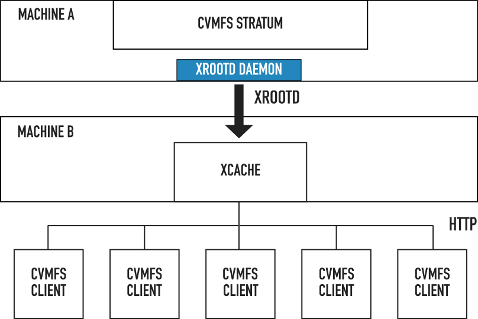
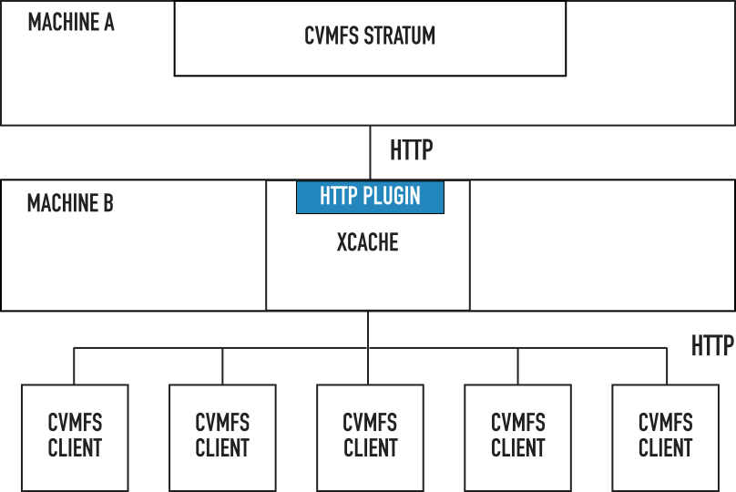

.. _cpt_xcache:

===================================
 Setting up an Xcache reverse proxy
===================================

This page describes how to set up an experimental HTTP reverse proxy
layer for CernVM-FS based on `Xcache
<http://xrootd.org/doc/dev47/pss_config.htm>`_.

NOTE: This is not a replacement for a general site forward proxy.
Forwarding needs to be defined separately in the Xcache configuration
for each destination Stratum 1, and the client CVMFS_SERVER_URL
configuration has to point to a separate forwarder URL for each
server.  This document is for the convenience of people who want too
experiment with this configuration.

Requirements
============

* A machine (labeled **Machine A**) to serve the contents of the
  CernVM-FS repository. Should have CernVM-FS server tools installed,
  as well as XRootD.

* A second machine (labeled **Machine B**) to use as a reverse proxy. Only
  XRootD is needed on this machine.

* A CernVM-FS client to mount the repository, for testing.

Instructions
============

`XRootD <http://xrootd.org>`_ is a high-performance, scalable file
distribution solution. It has a plugin-based architecture and can be
configured to suit various use cases. In the Xcache configuration, an
XRootD daemon functions as a reverse proxy, serving the contents of a data
repository over HTTP.

The following diagram shows how Xcache can be deployed as a cache
layer between a CernVM-FS repository and client machines:

|

**Machine A** contains a CernVM-FS repository, served by default over
HTTP. An Xcache instance is running on a second machine. By default
Xcache can only ingest files from another XRootD instance - we start
an instance of XRootD on the same machine as the CernVM-FS repository,
configured to export the repository using the XRootD protocol. The
following configuration can be used for this instance of XRootD,
replacing ``<CVMFS_REPOSITORY_NAME>`` with the actually name of the
repository: ::

   oss.localroot /srv
   all.export /cvmfs/<CVMFS_REPOSITORY_NAME> r/o

   all.adminpath /var/spool/xrootd
   all.pidpath   /var/run/xrootd

   xrd.trace all

The Xcache instance running on the second machine can be pointed to
the XRootD daemon started on the first one
(``<CVMFS_REPOSITORY_NAME>`` should be replaced with the actual
repository name and ``MACHINE_A_HOSTNAME`` with the actual host name
of the first machine): ::

   all.adminpath /var/spool/xrootd
   all.pidpath   /var/run/xrootd

   oss.localroot  /data/namespace

   all.export /cvmfs/<CVMFS_REPOSITORY_NAME>

   oss.space meta /data/xrdcinfos
   oss.space data /data/datafiles

   xrd.protocol http:3000 /usr/lib64/libXrdHttp.so
   xrd.trace all

   ofs.osslib   /usr/lib64/libXrdPss.so
   pss.cachelib /usr/lib64/libXrdFileCache.so
   pss.config streams 32
   pss.origin = <MACHINE_A_HOSTNAME>:1094

   pfc.ram 4g
   pfc.diskusage 0.5 0.6
   pfc.spaces data meta
   pfc.blocksize 1M
   pfc.prefetch 0
   pfc.trace info

With this configuration, Xcache re-exports the contents of the
repository over HTTP, on port 3000. Interested CernVM-FS clients can
be configured to use the Xcache instance by modifying the
``CVMFS_SERVER_URL`` variable: ::

   CVMFS_SERVER_URL=http://<MACHINE_B_HOSTNAME>:3000/cvmfs/<CVMFS_REPOSITORY_NAME>

Cache invalidation
==================

A current limitation of Xcache is that cached files are never
invalidated. In the context of CernVM-FS, this means that newly
published root catalogs are not picked up automatically. An Xcache
plugin is being developed to address this limitation.

Ingestion over HTTP
===================

A new `XRootD client plugin <https://github.com/xrootd/xrdcl-http>`_
is being developed to allow the Xcache instance to ingest files over
HTTP:

|

This set up is non-intrusive, as the machine serving the CernVM-FS
repository no longer needs to be modified in any way. Xcache could
thus be deployed as a reverse proxy layer for existing CernVM-FS stratum
servers.
