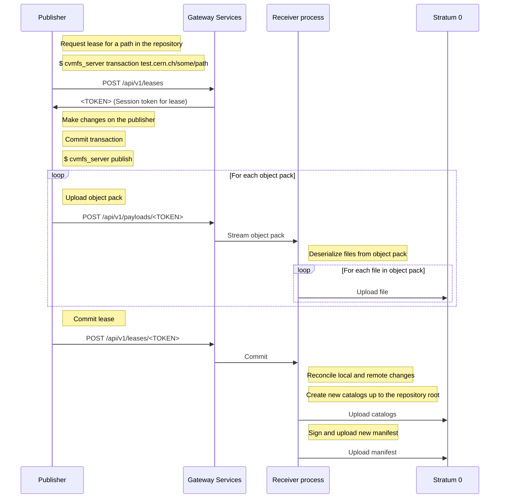

# The CernVM-FS Repository Gateway and Publishers
This page describes the distributed CernVM-FS publication architecture,
composed of a repository gateway machine and separate publisher
machines.

## Glossary

Publisher

:   A machine running the CernVM-FS server tools which can publish to a
    number of repositories, using a repository gateway as mediator.

    The resource-intensive parts of the publication operation take place
    here: compressing and hashing the files which are to be added or
    modified. The processed files are then packed together and sent to
    the gateway to be inserted into the repository and made available to
    clients.

Repository gateway

:   This machine runs the `cvmfs-gateway` application. It is the sole
    entity able to write to the authoritative storage of the managed
    repositories, either by mounting the storage volume or through an S3
    API.

    The role of the gateway is to mediate access to a set of
    repositories by assigning exclusive leases for specific repository
    sub-paths to different publisher machines. The gateway receives
    payloads from publishers, in the form of object packs, which it
    processes and writes to the repository storage. Its final task is to
    rebuild the catalogs and repository manifest of the modified
    repositories at the end of a successful publication transaction.

## Repository gateway configuration

Install the `cvmfs-gateway` package on the gateway machine. Packages for
various platforms are available for download
[here](https://cernvm.cern.ch/fs/#download).

When the CernVM-FS client and server packages are also installed and set
up as a stratum 0, it's possible to use the gateway machine as a master
publisher (for example to perform some initialization operations on a
repository, before a separate publisher machine is set up). To avoid any
possible repository corruption, the gateway application should always be
stopped before starting a local repository transaction on the gateway
machine.

With the gateway application installed, create the repository which will
be used for the rest of this guide: :

    # cvmfs_server mkfs -o root test.cern.ch

Create an API key file for the new repo (replace `<KEY_ID>` and
`<SECRET>` with actual values): :

    # cat <<EOF > /etc/cvmfs/keys/test.cern.ch.gw
    plain_text <KEY_ID> <SECRET>
    EOF
    # chmod 600 /etc/cvmfs/keys/test.cern.ch.gw

Since version 1.0 of `cvmfs-gateway`, the repository and key
configuration have been greatly simplified. If an API key file is
present at the conventional location
(`/etc/cvmfs/keys/<REPOSITORY_NAME>.gw`), it will be used by default as
the key for that repository. The repository configuration file only
needs to specify which repositories are to be handled by the
application: :

    # cat <<EOF > /etc/cvmfs/gateway/repo.json
    {
      "version": 2,

      "repos": [
        "test.cern.ch"
      ]
    }
    EOF

The `"version": 2` property enables the use of the improved
configuration syntax. If this property is omitted, the parser will
interpret the file using the legacy configuration syntax, maintaining
compatibility with existing configuration files (see [Legacy repository
configuration syntax](#legacy-repository-configuration-syntax)). The
[Advanced repository configuration](#advanced-repository-configuration)
section shows how to implement more complex key setups.

In addition to `repo.json`, the `user.json` configuration file contains
runtime parameters for the gateway application. The most important are:

-   `max_lease_time` - the maximum duration, in seconds, of an acquired
    lease
-   `port` - the TCP port on which the gateway application listens, 4929
    by default (the legacy name for this option is "fe_tcp_port")
-   `num_receivers` - the number of parallel `cvmfs_receiver` worker
    processes to be spawned. Default value is 1, and it should not be
    increased beyond the number of available CPU cores (the legacy name
    of this option is the `size` entry in the `receiver_config` map).

To access the gateway service API, the specified `port` needs to be open
in the firewall. If the gateway machine also serves as a repository
stratum 0 (i.e. the repository is created with "local" upstream), then
the port on which httpd listens (80 by default) also needs to be open
for TCP.

!!! note

    The gateway service receives data from publishers via HTTP transport.
    However, since the gateway and publisher have a shared secret (the API
    key), it is not strictly necessary to use TLS certificates and HTTPS to
    secure the connection to the gateway. Instead, to ensure the integrity
    and authenticity of content during the publishing process, a hash-based
    message authentication code (HMAC) is produced by a publisher, and
    verified by the gateway.

Finally, to start the gateway application, use `systemctl` if systemd is
available: :

    # systemctl start cvmfs-gateway.service

otherwise use the service command: :

    # service cvmfs-gateway start

Note that in order to apply any gateway configuration changes, including
changes to the API keys, the gateway service must be restarted.

If systemd is available, the application logs can be consulted with: :

    # journalctl -u cvmfs-gateway

Additional log files may also be found in `/var/log/cvmfs-gateway` and
`/var/log/cvmfs-gateway-runner`.

### Running under a different user

By default, the `cvmfs-gateway` application is run as root. An included
systemd service template file allows running it as an arbitrary user: :

    # systemctl start cvmfs-gateway@<USER>

To consult the logs of the application instance running as
[<USER>]{.title-ref}, run: :

    # journalctl -u cvmfs-gateway@<USER>

## Publisher configuration

This section describes how to set up a publisher for a specific CVMFS
repository. The precondition is a working gateway machine where the
repository has been created as a Stratum 0.

### Example procedure

-   The gateway machine is `gateway.cern.ch`.
-   The publisher is `publisher.cern.ch`.
-   The new repository's fully qualified name is `test.cern.ch`.
-   The repository's public key (RSA) is `test.cern.ch.pub`.
-   The repository's public key (encoded as an X.509 certificate) is
    `test.cern.ch.crt`.
-   The gateway API key is `test.cern.ch.gw`.
-   The gateway application is running on port 4929 at the URL
    `http://gateway.cern.ch:4929/api/v1`.
-   The three key files for the repository (.pub, .crt, and .gw) have
    been copied from the gateway machine onto the publisher machine, in
    the directory `/tmp/test.cern.ch_keys/`.

To make the repository available for writing on `publisher.cern.ch`, run
the following command on that machine as a non-root user with sudo
access: :

    $ sudo cvmfs_server mkfs -w http://gateway.cern.ch/cvmfs/test.cern.ch \
                             -u gw,/srv/cvmfs/test.cern.ch/data/txn,http://gateway.cern.ch:4929/api/v1 \
                             -k /tmp/test.cern.ch_keys -o `whoami` test.cern.ch

At this point, it's possible to start writing into the repository from
the publisher machine: :

    $ cvmfs_server transaction test.cern.ch

Alternatively, to take advantage of the gateway functionality which
allows concurrent transactions on different paths of a repository, or
fine-grained permission to only publish changes in certain paths, you
can request a publishing lease that is scoped to a subdirectory of the
repository by starting a transaction like this: :

    $ cvmfs_server transaction test.cern.ch/example/path

Then to commit the changes to the repository and publish: :

    $ cvmfs_server publish

## Querying the gateway machine

The configuration and current state of the gateway application can be
queried using standard HTTP requests. A "GET" request to the "repos"
endpoint returns the key configuration for all the repositories: :

    $ curl http://example.gateway.org:4929/api/v1/repos  jq

    {
      "data": {
        "example.repo.org": {
          "key1": "/"
        }
      },
      "status": "ok"
    }

The configuration of a single repository can also be obtained: :

    $ curl http://example.gateway.org:4929/api/v1/repos/example.repo.org  jq

    {
      "data": {
        "key1": "/"
      },
      "status": "ok"
    }

The list of current active leases can be obtained as follows: :

    $ curl http://example.gateway.org:4929/api/v1/leases | jq

    {
      "data": {
        "example.repo.org/sub/dir/1": {
          "key_id": "key1",
          "expires": "2019-05-09 23:10:31.730136676 +0200 CEST"
        },
        "example.repo.org/sub/dir/2": {
          "key_id": "key1",
          "expires": "2019-05-09 23:10:32.497061458 +0200 CEST"
        },
        "example.repo.org/sub/dir/3": {
          "key_id": "key1",
          "expires": "2019-05-09 23:10:31.935336579 +0200 CEST"
        }
      },
      "status": "ok"
    }

## Advanced repository configuration

It's possible to register multiple API keys with each repository, and
each key can be restricted to a specific subpath of the repository. When
there are multiple keys for the same repository, and they are defined as
files, naturally they can not all have the same filename, so at least
some of them will be in a location not automatically imported by the
gateway. For this reason, all the key file names need to be explicitly
enumerated. Keys can also be declared inline. The `"version": 2`
property needs to be specified for this configuration format to be
accepted: :

    {
      "version": 2,
      "repos": [
        {
          "domain": "test.cern.ch",
          "keys": [
            {
              "id": "keyid1",
              "path": "/"
            },
            {
              "id": "keyid2",
              "path": "/restricted/to/subdir"
            }
          ]
        }
      ],
      "keys": [
        {
          "type": "file",
          "file_name": "/etc/cvmfs/keys/test.cern.ch.gw"
        },
        {
          "type": "plain_text",
          "id": "keyid2",
          "secret": "<SECRET>"
        }
      ]
    }

It should be noted that when keys are loaded from a file, an `id` field
does not need to be specified in the configuration file. The public ID
of the loaded key is the one specified in the key file itself.

## Legacy repository configuration syntax

In the legacy repository configuration format, subpath restrictions are
given with the key declaration, not when associating the keys with the
repository: :

    {
      "repos": [
        {
          "domain": "test.cern.ch",
          "keys": ["<KEY_ID>"]
        }
      ],
      "keys": [
        {
          "type": "file",
          "file_name": "/etc/cvmfs/keys/test.cern.ch.gw",
          "repo_subpath": "/"
        }
      ]
    }

## Updating from cvmfs-gateway-0.2.5

In the first published version, `cvmfs-gateway-0.2.5`, the application
files were installed under `/opt/cvmfs-gateway` and the database files
under `/opt/cvmfs-mnesia`. Starting with version 0.2.6, the application
is installed under `/usr/libexec/cvmfs-gateway`, while the database
files are under `/var/lib/cvmfs-gateway`.

When updating from 0.2.5, please make sure that the application is
stopped: :

    # systemctl stop cvmfs-gateway

and rerun the setup script: :

    # /usr/libexec/cvmfs-gateway/scripts/setup.sh

At this point, the new version of the application can be started. If the
old directories are still present, they can be deleted: :

    # rm -r /opt/cvmfs-{gateway,mnesia}

## API reference

This section describes the HTTP API exposed by the gateway application.

### Repositories

#### GET /repos

Retrieve the list of all configured repositories

**Response**

``` json
{
  "data": {
    "test1.cern.ch": {
      "keys": {
        "k1": "/"
      },
      "enabled": true
    }
  },
  "status": "ok"
}
```

#### GET /repos/<REPO_NAME>

Retrieve the configuration for a repository

**Response**

``` json
{
  "data": {
    "keys": {
      "k1": "/"
    },
    "enabled": true
  },
  "status": "ok"
}
```

### Leases

#### GET /leases

Retrieve the current list of leases

**Response**

``` json
{
  "data": {
    "test1.cern.ch/": {
      "key_id": "k1",
      "expires": "2021-10-25 22:02:12.688703553 +0000 UTC"
    }
  },
  "status": "ok"
}
```

#### GET /leases/<TOKEN>

Retrieve information about the lease identified by the given token

**Response**

``` json
{
  "data": {
    "key_id": "k1",
    "path": "test1.cern.ch/",
    "expires": "2021-10-25 22:14:12.695939889 +0000 UTC"
  }
}
```

#### POST /leases

Request a new lease

**Headers**

<div class="dl-table-header dl-table-header--two-column">
  <span>Header</span>
  <span>Description</span>
</div>

`Authorization`
: Value: `"<KEY_ID> <HMAC>"`. `<KEY_ID>` identifies a gateway key used to sign the message and `<HMAC>` is the keyed-hash message authentication code (HMAC) of the request body.

**Request parameters**

<div class="dl-table-header dl-table-header--two-column">
  <span>Parameter</span>
  <span>Description</span>
</div>

`api_version`
: API version requested by the client (passed as a string). Example: `"3"`.

`path`
: Repository subpath on which a lease is requested. Example: `"test1.cern.ch/path/to/lease"`.

**Response (success)**

<div class="dl-table-header dl-table-header--two-column">
  <span>Field</span>
  <span>Description</span>
</div>

`status`
: Response status. Value: `"ok"`.

`session_token`
: String containing the session token associated with the new lease. Value: `"<TOKEN>"`.

`max_api_version`
: Max API version usable for the remainder of the session. Value: `3`.

**Response (path busy)**

<div class="dl-table-header dl-table-header--two-column">
  <span>Field</span>
  <span>Description</span>
</div>

`status`
: There is a conflicting lease for the requested path. Value: `"path_busy"`.

`time_remaining`
: Remaining lease time in seconds. Value: `1234`.

**Response (error)**

<div class="dl-table-header dl-table-header--two-column">
  <span>Field</span>
  <span>Description</span>
</div>

`status`
: An error occurred. Value: `"error"`.

`reason`
: Description text of the error. Value: `"Something went wrong"`.

#### POST /leases/<TOKEN>

Commit all changes associated with a lease

**Headers**

<div class="dl-table-header dl-table-header--two-column">
  <span>Header</span>
  <span>Description</span>
</div>

`Authorization`
: Value: `"<KEY_ID> <HMAC>"`. `<KEY_ID>` identifies a gateway key used to sign the message and `<HMAC>` is the keyed-hash message authentication code (HMAC) of the request's path component (`/lease/<TOKEN>`).

**Request parameters**

<div class="dl-table-header dl-table-header--two-column">
  <span>Parameter</span>
  <span>Description</span>
</div>

`old_root_hash`
: Initial root hash of the repository. Example: `"abcd3f"`.

`new_root_hash`
: New root hash of the repository. Example: `"bfa42b"`.

`tag_name`
: Tag associated with the publication. Example: `"Monday"`.

`tag_channel`
: Name of the publication channel. Example: `"Nightlies"`.

`tag_description`
: Description of the tag. Example: `"Nightly builds, Monday's batch"`.

**Response (success)**

<div class="dl-table-header dl-table-header--two-column">
  <span>Field</span>
  <span>Description</span>
</div>

`status`
: Response status. Value: `"ok"`.

`final_revision`
: New revision of the repository after committing the changes associated with a lease. Value: `1234`.

**Response (error)**

<div class="dl-table-header dl-table-header--two-column">
  <span>Field</span>
  <span>Description</span>
</div>

`status`
: An error occurred. Value: `"error"`.

`reason`
: Description text of the error. Value: `"Something went wrong"`.

#### DELETE /leases/<TOKEN>

Cancel a lease

**Headers**

<div class="dl-table-header dl-table-header--two-column">
  <span>Header</span>
  <span>Description</span>
</div>

`Authorization`
: Value: `"<KEY_ID> <HMAC>"`. `<KEY_ID>` identifies a gateway key used to sign the message and `<HMAC>` is the keyed-hash message authentication code (HMAC) of the request's path component (`/lease/<TOKEN>`).

**Response (success)**

<div class="dl-table-header dl-table-header--two-column">
  <span>Field</span>
  <span>Description</span>
</div>

`status`
: Response status. Value: `"ok"`.

**Response (error)**

<div class="dl-table-header dl-table-header--two-column">
  <span>Field</span>
  <span>Description</span>
</div>

`status`
: An error occurred. Value: `"error"`.

`reason`
: Description text of the error. Value: `"Something went wrong"`.

### Payload submission

#### POST /payloads (deprecated)

Upload an object pack payload

**Headers**

<div class="dl-table-header dl-table-header--two-column">
  <span>Header</span>
  <span>Description</span>
</div>

`Authorization`
: Value: `"<KEY_ID> <HMAC>"`. `<KEY_ID>` identifies a gateway key used to sign the message and `<HMAC>` is the keyed-hash message authentication code (HMAC) of the JSON message at the start of the request body.

`message-size`
: Total length of the JSON message at the start of the request body. Example: `1234`.

**Request parameters**

<div class="dl-table-header dl-table-header--two-column">
  <span>Parameter</span>
  <span>Description</span>
</div>

`session_token`
: Session token associated with the lease. Example: `"<SESSION_TOKEN>"`.

`payload_digest`
: Digest of the payload part (serialized object pack) of the request. Example: `"bfa42b"`.

`header_size`
: Size of the payload header (the header of the serialized object pack). Example: `1234`.

`api_version`
: API version tag (unused). Example: `"3"`.

The upload payload (the serialized object pack) comes after the JSON
part of the message.

**Response (success)**

<div class="dl-table-header dl-table-header--two-column">
  <span>Field</span>
  <span>Description</span>
</div>

`status`
: Response status. Value: `"ok"`.

**Response (error)**

<div class="dl-table-header dl-table-header--two-column">
  <span>Field</span>
  <span>Description</span>
</div>

`status`
: An error occurred. Value: `"error"`.

`reason`
: Description text of the error. Value: `"Something went wrong"`.

#### POST /payloads/<TOKEN>

Upload an object pack payload

**Headers**

<div class="dl-table-header dl-table-header--two-column">
  <span>Header</span>
  <span>Description</span>
</div>

`Authorization`
: Value: `"<KEY_ID> <HMAC>"`. `<KEY_ID>` identifies a gateway key used to sign the message and `<HMAC>` is the keyed-hash message authentication code (HMAC) of the session token.

`message-size`
: Total length of the JSON message at the start of the request body. Example: `1234`.

**Request parameters**

<div class="dl-table-header dl-table-header--two-column">
  <span>Parameter</span>
  <span>Description</span>
</div>

`payload_digest`
: Digest of the payload part (serialized object pack) of the request. Example: `"bfa42b"`.

`header_size`
: Size of the payload header (the header of the serialized object pack). Example: `1234`.

`api_version`
: API version tag (unused). Example: `"3"`.

The upload payload (the serialized object pack) comes after the JSON
part of the message.

**Response (success)**

<div class="dl-table-header dl-table-header--two-column">
  <span>Field</span>
  <span>Description</span>
</div>

`status`
: Response status. Value: `"ok"`.

**Response (error)**

<div class="dl-table-header dl-table-header--two-column">
  <span>Field</span>
  <span>Description</span>
</div>

`status`
: An error occurred. Value: `"error"`.

`reason`
: Description text of the error. Value: `"Something went wrong"`.

### Notifications

#### POST /notifications/publish

Publish a notification

**Request parameters**

<div class="dl-table-header dl-table-header--two-column">
  <span>Parameter</span>
  <span>Description</span>
</div>

`version`
: API version tag (unused). Example: `1`.

`timestamp`
: Timestamp. Example: `"26 Oct 2021 15:00:00"`.

`type`
: Message type (no other values are currently used). Example: `"activity"`.

`repository`
: Repository name. Example: `"test.cern.ch"`.

`manifest`
: The serialized signed repository manifest. Example: `"<MANIFEST STRING>"`.

**Response (success)**

<div class="dl-table-header dl-table-header--two-column">
  <span>Field</span>
  <span>Description</span>
</div>

`status`
: Response status. Value: `"ok"`.

**Response (error)**

<div class="dl-table-header dl-table-header--two-column">
  <span>Field</span>
  <span>Description</span>
</div>

`status`
: An error occurred. Value: `"error"`.

`reason`
: Description text of the error. Value: `"Something went wrong"`.

#### GET /notifications/subscribe

Subscribe to notifications

**Request parameters**

<div class="dl-table-header dl-table-header--two-column">
  <span>Parameter</span>
  <span>Description</span>
</div>

`version`
: API version tag (unused). Example: `1`.

`repository`
: Target repository name. Example: `"test.cern.ch"`.

This request opens a long-running connection to the notification server.
Messages are delivered as server-sent events (SSE), one per line:

```
data: <JSON MESSAGE>
```

**Messages**

<div class="dl-table-header dl-table-header--two-column">
  <span>Field</span>
  <span>Description</span>
</div>

`version`
: API version tag (unused). Example: `1`.

`timestamp`
: Timestamp. Example: `"26 Oct 2021 15:00:00"`.

`type`
: Message type (no other values are currently used). Example: `"activity"`.

`repository`
: Repository name. Example: `"test.cern.ch"`.

`manifest`
: The serialized signed repository manifest. Example: `"<MANIFEST STRING>"`.

## Publication workflow


